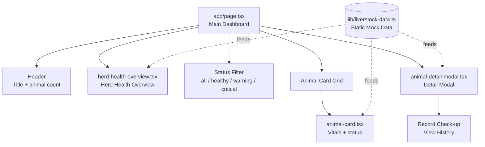
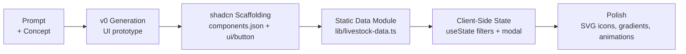
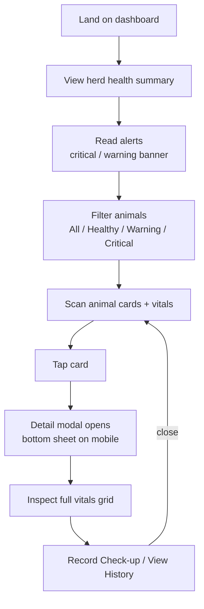
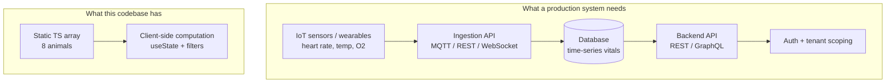
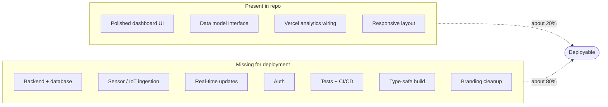
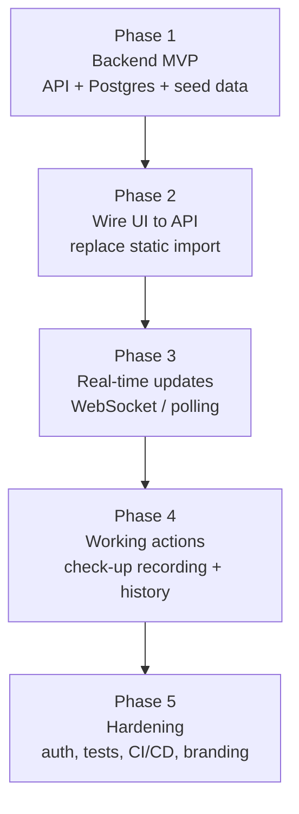

# Nearling Pulse — Codebase Analysis

> **Project:** Nearling Pulse — Livestock Health Monitoring System
> **Date of analysis:** 2026-08-06
> **Scope:** Full codebase review (app, components, lib, public, config)

---

## Executive Summary

Nearling Pulse is a **UI prototype** for a livestock health monitoring dashboard. It presents a polished, single-page dashboard showing herd-level health metrics and per-animal vital signs. However, **every data point is hardcoded mock data** — there is no sensor ingestion, no backend, no database, and no real-time pipeline. It was generated as a v0 prompt-to-prototype artifact and is **not deployable as a product** without substantial backend and integration work.

---

## 1. What This Is

A single-page dashboard (Next.js App Router) for monitoring the health of livestock through vital signs: heart rate, pulse, temperature, oxygen saturation, and a "digestive score."

### Tech Stack

| Layer | Technology |
|---|---|
| Framework | Next.js 16.3 (App Router) |
| UI Library | React 19 |
| Language | TypeScript 5.7 |
| Styling | Tailwind CSS v4 + `tw-animate-css` |
| UI Components | shadcn/ui ("base-nova" style) + `@base-ui/react` |
| Icons | `lucide-react` |
| Analytics | `@vercel/analytics` |
| Package Manager | pnpm |

### Application Structure



### The Five Files That Matter

| File | Role |
|---|---|
| `app/page.tsx` | Single dashboard page; owns filter + modal state |
| `lib/livestock-data.ts` | `LivestockAnimal` interface + 8 hardcoded animals + aggregate helpers |
| `components/herd-health-overview.tsx` | Herd gauge, status cards, average vitals, alert banner |
| `components/animal-card.tsx` | Per-animal card with vitals + hand-drawn SVG icon |
| `components/animal-detail-modal.tsx` | Bottom-sheet/centered modal with full vitals grid |

---

## 2. Methodology Used to Build It

This project was built through **v0 (Vercel) prompt-to-prototype generation**, then lightly scaffolded with shadcn. Evidence:

- `app/layout.tsx` metadata: `title: 'v0 App'`, `generator: 'v0.app'`
- `.gitignore` contains v0 sandbox internals (`__v0_runtime_loader.js`, `__v0_devtools.tsx`, `.snowflake/`, `.v0-trash/`)
- `package.json` retains the default name `"my-project"`
- `public/` contains stock v0 placeholders

### Default v0 Placeholder Assets


### Build Pattern — Frontend-First, Mock-Data-Driven



Key characteristics of the methodology:

1. **UI-first**: all effort went into visual presentation (gradients, gauges, animations, custom SVG animal icons).
2. **Data-last**: data is a static TypeScript array; no fetching, no server components, no API routes.
3. **Client-side only**: the entire app is `'use client'` — filtering and "metrics" are computed in the browser on each render.
4. **Scaffolding overuse**: shadcn + Base UI were installed, but the app bypasses them with raw `<button>` elements and inline Tailwind. `components/ui/button.tsx` is exported but never imported anywhere.
5. **No engineering hygiene**: no tests, no ESLint config (despite a `lint` script), no git repository, type checking disabled at build (`typescript.ignoreBuildErrors: true`).

---

## 3. Proposed User Flow



### Step-by-Step Walkthrough

1. **Land on dashboard** — header shows the title, subtitle, total animal count, and a "Updated 2 minutes ago" timestamp.
2. **Herd Health Overview** — an overall health percentage gauge, three status cards (Healthy / Warning / Critical), average heart rate, temperature, and O₂, plus a red or yellow alert banner when issues exist.
3. **Filter animals** — toggle chips for All / Healthy / Warning / Critical to narrow the grid.
4. **Browse cards** — each card shows name, ID, a colored status dot, heart rate, temperature, O₂, and a status label.
5. **Open detail modal** — tapping a card opens a detail view: large visualization, health progress bar, 4-tile vitals grid (heart rate, pulse, temperature, O₂), digestive score, weight, location, and last checkup date.
6. **Quick actions** — "Record Check-up" and "View History" buttons are present but **non-functional** (no handlers wired).

---

## 4. Mock Data vs. Real

**Verdict: 100% mock.** Every piece of data is hardcoded in `lib/livestock-data.ts`.

### What's Mock

| Aspect | Reality |
|---|---|
| Animals | 8 hardcoded entries (6 cows, 2 sheep); `goat` / `pig` types in the interface are never used |
| Vitals | Static literals — heart rate, pulse, temp, O₂, digest score never change |
| "Real-time monitoring" | Fake — no update mechanism exists |
| "Updated 2 minutes ago" | Fabricated — no timestamps are tracked |
| Herd metrics | Computed client-side from the same static array on every render |
| Checkup dates | Stale (August 2024) and inconsistent with the "2 minutes ago" claim |
| Actions | `Record Check-up` and `View History` are dead buttons |

### Mock vs. Real Comparison



### Where the Mock Data Lives

```typescript
// lib/livestock-data.ts — the entire "database"
export const livestockData: LivestockAnimal[] = [
  { id: 'COW-001', name: 'Bessie', heartRate: 68, temperature: 38.2, /* ... */ },
  // ... 7 more hardcoded entries
]
```

The interface (`LivestockAnimal`) is well-shaped and could map cleanly to a real backend — but today the module is both the schema *and* the entire data store.

---

## 5. Why It Is Not Deployable Yet

### Gap Analysis

| # | Gap | Severity | Detail |
|---|---|---|---|
| 1 | **No data layer** | 🔴 Critical | The product premise is live vitals; there is zero sensor ingestion, API, or database |
| 2 | **Misleading static UI** | 🔴 Critical | "Real-time monitoring" / "Updated 2 minutes ago" are fabricated — deploying ships a demo as a product |
| 3 | **Non-functional features** | 🟠 High | `Record Check-up` and `View History` have no `onClick` handlers |
| 4 | **Type safety disabled** | 🟠 High | `next.config.mjs` sets `typescript.ignoreBuildErrors: true` |
| 5 | **Broken tooling** | 🟠 High | No ESLint config (script exists), not a git repository, no CI/CD |
| 6 | **No env config / routes** | 🟠 High | No `.env*`, no `app/api/`, no middleware, no auth |
| 7 | **Unfinished branding** | 🟡 Medium | `name: "my-project"`, metadata `title: 'v0 App'`, placeholder logos |
| 8 | **Code-quality debt** | 🟡 Medium | Status color logic duplicated 4+ times; unused `ui/button.tsx`; no tests; no README |

### Deployability Scorecard



### Path to Production (Suggested Roadmap)



---

## Appendix: File Inventory

```
nearlinq-pulsee/
├── app/
│   ├── globals.css          # Tailwind v4 + shadcn theme tokens
│   ├── layout.tsx           # v0 metadata, Vercel Analytics
│   └── page.tsx             # Main dashboard (only page)
├── components/
│   ├── animal-card.tsx      # Per-animal card
│   ├── animal-detail-modal.tsx  # Detail modal
│   ├── herd-health-overview.tsx # Herd summary
│   └── ui/
│       └── button.tsx       # shadcn Button (unused)
├── lib/
│   ├── livestock-data.ts    # Interface + 8 mock animals + metric helpers
│   └── utils.ts             # cn() helper
├── public/                  # v0 placeholder assets
├── .gitignore               # v0 sandbox internals
├── components.json          # shadcn config
├── next.config.mjs          # ignoreBuildErrors: true
├── package.json             # "my-project", lint script w/o config
├── tsconfig.json            # strict, @/* path alias
└── pnpm-lock.yaml
```
