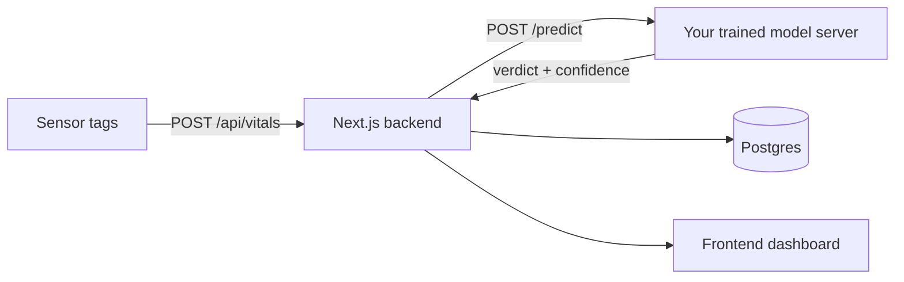

# Nearling Pulse

Livestock health monitoring system — sensor tags → your trained ML model → dashboard.

## Architecture



Three tiers, cleanly separated:

1. **Frontend** — the existing dashboard UI (Phase 0 mockup, preserved).
2. **Backend** — Next.js route handlers (`app/api/*`) + Postgres (Drizzle ORM).
3. **Model** — **trained by you**, served behind a documented HTTP contract. The backend calls it via `MODEL_API_URL`; a rule-based fallback keeps the system running until it's live.

## Quickstart

```bash
pnpm install
docker compose up -d          # local Postgres (or point DATABASE_URL at Neon)
cp .env.example .env
pnpm db:push                   # create tables
pnpm seed                      # seed the original mock animals into the DB
pnpm dev                       # http://localhost:3000
```

Simulate live sensor data (in a second terminal):

```bash
pnpm simulate
```

No database handy? Set `NEXT_PUBLIC_DEMO_MODE=true` in `.env` and run `pnpm dev` — the dashboard renders from the built-in mock data.

Wire up your model when ready — see `docs/MODEL_CONTRACT.md` and `model-server/`.

## Scripts

| Script | Purpose |
|---|---|
| `pnpm dev` | Dev server |
| `pnpm lint` / `pnpm typecheck` / `pnpm build` | Quality gates |
| `pnpm db:generate` / `pnpm db:migrate` / `pnpm db:push` | Drizzle migrations |
| `pnpm seed` | Seed DB from the original mock data |
| `pnpm simulate` | Emit jittered vitals to the ingestion API |

## API

| Route | Purpose |
|---|---|
| `POST /api/auth/login` | Email+password login (sets session cookie) |
| `POST /api/auth/logout` | Clears the session cookie |
| `GET /api/auth/me` | Current session user |
| `GET /api/animals` | Animals + latest vital (mirrors old mock shape) |
| `GET /api/animals/[id]` | Detail + vitals history + checkups (mapped for charting) |
| `GET /api/animals/[id]/checkups` | List check-ups |
| `POST /api/animals/[id]/checkups` | Record a check-up (weight, notes, performed-by) |
| `GET /api/dashboard` | Herd metrics |
| `POST /api/vitals` | Sensor ingestion (needs org `X-Ingest-Key`) |
| `GET /api/stream` | SSE — pushes `vitals` events when new readings land |

Every API route is scoped to the session user's organization (`organizations`);
sensor ingestion is scoped by the organization's ingest key. In demo mode
(`NEXT_PUBLIC_DEMO_MODE=true`) the proxy skips auth so the UI works without a
backend — set it only for local previews.

## Status

**All six roadmap phases are done** — the MVP is complete and CI-ready:

- Phase 0: tooling, branding, type-safe build
- Phase 1: backend MVP (Postgres, API, model seam, seed, simulator)
- Phase 2: frontend wired to the API (demo-mode fallback)
- Phase 3: real-time (polling + SSE + change highlight)
- Phase 4: check-up recording + vitals history charts
- Phase 5: auth & multi-tenant (JWT sessions, org scoping, per-org ingest keys)
- Phase 6: tests, CI, rate limiting, launch checklist

**What's left:** train your model (`docs/TRAINING.md`), wire real sensor
hardware, and deploy (`docs/LAUNCH-CHECKLIST.md`). The rules-based fallback
keeps the product fully functional until your model is live.
