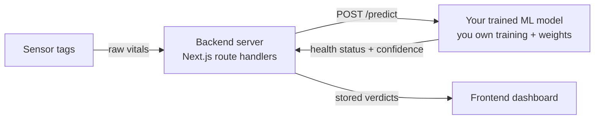
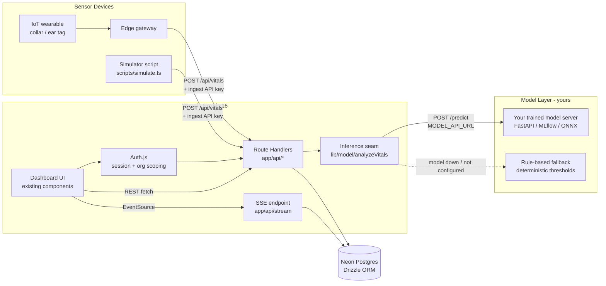
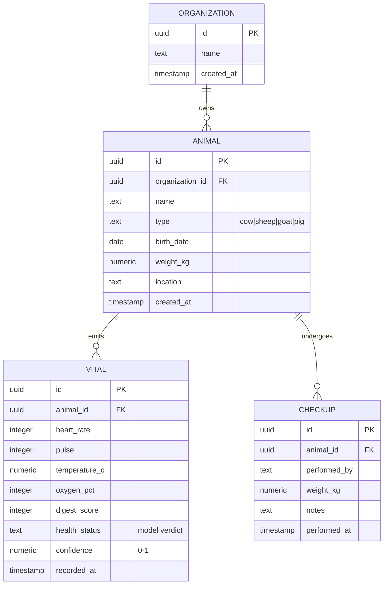
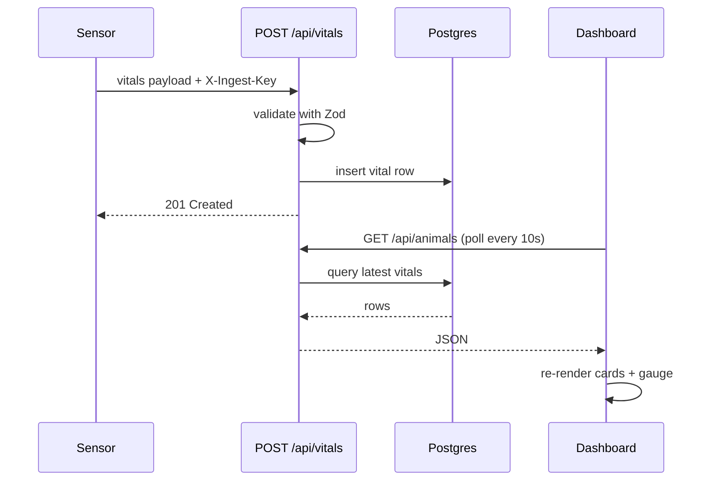
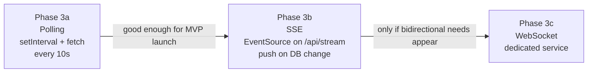
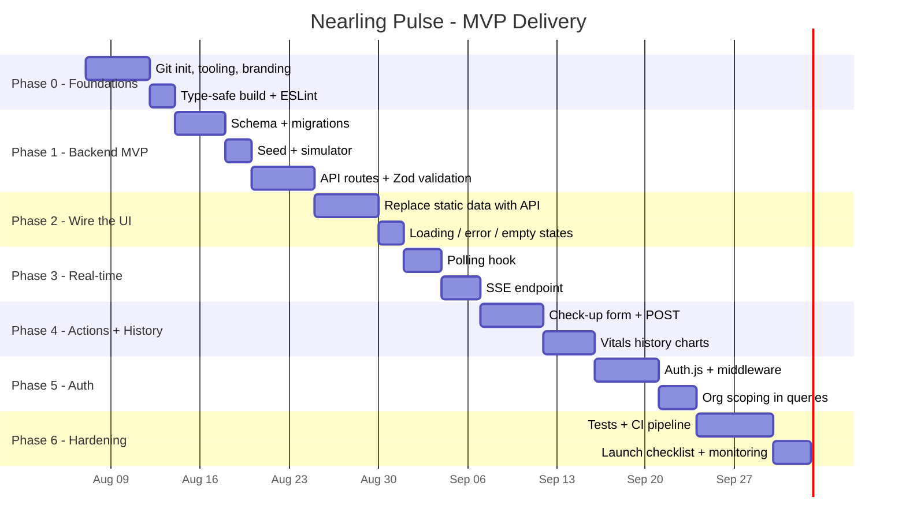

# Nearling Pulse — MVP Architecture & Delivery Roadmap

> **Goal:** Turn the v0 UI mockup into a deployable MVP without rewriting the UI.
> **Strategy:** Keep the existing dashboard components as-is and replace the mock data layer with a real backend, behind a clean API boundary.
> **Target platform:** Vercel + serverless Postgres (Neon) — zero-ops, matches the existing Next.js setup.

---

## 1. Guiding Principles

1. **The UI is the asset — don't rewrite it.** `animal-card.tsx`, `herd-health-overview.tsx`, and the modal are presentationally done. Only their *data source* changes.
2. **Monolith first.** Everything lives in this Next.js app (route handlers = API). Extract a separate service only if a bottleneck proves it necessary.
3. **Demo mode forever.** `DEMO_MODE=true` keeps the app runnable with the existing mock data, so the repo stays useful for previews without infrastructure.
4. **Deployable after every phase.** Each phase ends green: `pnpm lint` + `pnpm typecheck` + `pnpm build` pass.

---

## 1b. The ML Model — Your Responsibility

Your mental model is exactly the target architecture: **frontend → backend → your trained model → verdicts → frontend**. The only refinement: sensor data lands in Postgres first, then the backend runs the model analysis on each reading and stores the verdict, and the dashboard reads stored verdicts.



The seam is `lib/model/analyzeVitals()`:

- `MODEL_API_URL` set → every reading is analyzed by **your** model server (`POST /predict`)
- not set / model down → **rule-based fallback** (deterministic thresholds) keeps the system running
- the browser never talks to the model; the backend never calls the model directly

Your side of the deal: the training data, features, architecture, and weights. The contract you must satisfy is documented in `docs/MODEL_CONTRACT.md`; a serving skeleton (FastAPI + joblib) lives in `model-server/`. Anything that honors the contract works — MLflow serve, ONNX Runtime, a PyTorch service.

---

## 2. Target Architecture



### Component Inventory (after build-out)

| Component | Role | Status |
|---|---|---|
| `app/page.tsx` | Dashboard; fetches herd metrics + animals | Rework data source |
| `herd-health-overview.tsx` | Herd stats | Accept data via props |
| `animal-card.tsx` | Animal card | Unchanged |
| `animal-detail-modal.tsx` | Detail + check-up form + history | Extend with actions |
| `app/api/*` (route handlers) | REST + ingestion + SSE | New |
| `db/` (Drizzle schema + client) | Data access | New |
| `lib/auth.ts` | Auth.js config | New |
| `scripts/seed.ts`, `scripts/simulate.ts` | Seed + live-data demo | New |

---

## 3. Technology Decisions (Decision Log)

| Decision | Options | Recommendation | Rationale |
|---|---|---|---|
| Hosting | Vercel / AWS / self-host | **Vercel** | Already Next.js + Vercel Analytics; zero-ops deploys |
| Database | Neon / Supabase / RDS | **Neon Postgres** | Serverless, generous free tier, native Drizzle support |
| ORM | Drizzle / Prisma / raw SQL | **Drizzle** | SQL-first, TS-native types, no engine binaries on serverless; Prisma is the fallback if team prefers its DX |
| Auth | Auth.js (NextAuth v5) / Clerk / Supabase Auth | **Auth.js v5** | No vendor lock, credentials + OAuth, fits Next.js middleware; choose Clerk only if you want auth done for you |
| Real-time | Polling / SSE / WebSocket | **Polling → SSE** | Dashboard is read-heavy one-way traffic; SSE is cheap on Vercel, WebSocket adds infra |
| Sensor ingestion | REST + API key / MQTT | **REST first** | MQTT needs a broker + worker; add later when device count demands it |
| Validation | Zod / Joi / manual | **Zod** | TS-first; schemas shared between ingestion and Drizzle types |
| Charts (history) | Recharts / Chart.js / Tremor | **Recharts** | React-native, simple line charts for vitals history |

---

## 4. Data Model



Notes:

- **`health_status` + `confidence` are stored per vital** — they are the *model's output* for that reading (or the rule-based fallback). The dashboard shows the analysis of the latest reading. Keeps a full history of predictions for auditability.
- **`vitals` is time-series shaped**: index on `(animal_id, recorded_at)`. At 1 reading/10s × 100 animals ≈ 864k rows/day — plain Postgres handles this for MVP; migrate to TimescaleDB if it becomes a problem.
- The existing `LivestockAnimal` interface in `lib/livestock-data.ts` maps 1:1 onto `ANIMAL + latest VITAL` — the seed script can reuse it.

---

## 5. API Contract

| Route | Method | Auth | Purpose |
|---|---|---|---|
| `/api/animals` | GET | session | List animals + latest vital each |
| `/api/animals/[id]` | GET | session | Animal detail + vitals history |
| `/api/animals/[id]/vitals` | GET | session | Vitals time-series (for charts) |
| `/api/animals/[id]/checkups` | GET / POST | session | List / create check-ups |
| `/api/dashboard` | GET | session | Herd metrics (gauge, counts, averages) |
| `/api/vitals` | POST | **API key** | Sensor ingestion (no session — devices aren't users) |
| `/api/stream` | GET (SSE) | session | Live updates for the open dashboard |
| Model server `/predict` | POST | optional key | **Your trained model** — called by the backend via `MODEL_API_URL`, never by the browser |

### Ingestion flow



### Env vars (`.env.example`)

```
DATABASE_URL=postgres://...
AUTH_SECRET=generate-a-long-random-string
VITALS_INGEST_KEY=shared-secret-for-devices
DEMO_MODE=false        # true = fall back to lib/livestock-data.ts
```

---

## 6. Real-Time Strategy (Evolve, Don't Over-Build)



- **Polling is the MVP answer.** One `useVitals` hook, ~30 lines, works on every host.
- **SSE** upgrades the same hook; Vercel supports streaming responses. Pushes on new vitals / checkups.
- **WebSocket is a maybe, not a must.** A monitoring dashboard rarely sends data *to* the server.

---

## 7. Phased Roadmap



### Phase 0 — Foundations ✅ done

**Goal:** a clean, type-safe, brandable repo that deploys as an empty shell.

- `git init`, prune v0 entries from `.gitignore`, add `README.md`, real favicon/branding, rename package, fix `layout.tsx` metadata ("Nearling Pulse", not "v0 App")
- Add `eslint.config.mjs` (typescript-eslint + react-hooks + next core-web-vitals) — the `lint` script currently has **no config**
- Remove `typescript.ignoreBuildErrors: true` from `next.config.mjs`

**Acceptance:** `pnpm lint`, `pnpm tsc --noEmit`, and `pnpm build` all pass; Vercel deploys it.

### Phase 1 — Backend MVP ✅ done

**Goal:** a real data layer behind an API, seeded from the existing mock data, with the model seam in place.

- ✅ `db/schema.ts` + `drizzle.config.ts` + `lib/db.ts` (Postgres + Drizzle; Neon-compatible, local docker-compose for dev)
- ✅ Migrations generated for `organizations`, `animals`, `vitals`, `checkups` (vitals stores the model verdict + confidence)
- ✅ `scripts/seed.ts` — imports `lib/livestock-data.ts` and inserts the mock animals as real rows (mock data *graduates* into seed data)
- ✅ `scripts/simulate.ts` — posts jittered vitals on an interval so the dashboard looks alive
- ✅ Route handlers: `/api/animals`, `/api/animals/[id]`, `/api/dashboard`, `/api/vitals` (API-key protected, Zod-validated)
- ✅ **Inference seam** `lib/model/` — `analyzeVitals()` calls your model at `MODEL_API_URL` with a rule-based fallback; contract in `docs/MODEL_CONTRACT.md`; serving skeleton in `model-server/`

**Acceptance:** `curl` each endpoint and see seeded data; ingestion of a vital stores the model verdict.

### Phase 2 — Wire the UI ✅ done

**Goal:** dashboard renders real data; demo mode still works.

- ✅ `lib/api.ts` — fetch client for `/api/animals` + `/api/dashboard`; `NEXT_PUBLIC_DEMO_MODE=true` falls back to `lib/livestock-data.ts`
- ✅ `app/page.tsx` fetches animals + herd metrics with loading skeletons, error state + retry, and an empty state
- ✅ `HerdHealthOverview` takes metrics via props; cards + modal take animals via props (no logic changes)
- ✅ Honest timestamps — the header shows the real `updatedAt` from the API instead of a hardcoded "2 minutes ago"
- ✅ `unknown`/no-vitals animals render as neutral gray instead of red "critical"

**Acceptance:** with a seeded DB, the UI shows the same dashboard as before — but now it's real.

### Phase 3 — Real-time ✅ done

**Goal:** vitals update without a page refresh.

- ✅ `hooks/use-vitals.ts` — one hook, two transports: 10s polling (default, works everywhere) or `EventSource` on `/api/stream` with a 30s heartbeat fallback
- ✅ `app/api/stream/route.ts` — SSE endpoint that watches Postgres for new readings (DB-poller, no broker needed) and pushes `vitals` events with the affected animal ids
- ✅ Changed cards flash with a blue ring for ~2.5s so the live feel is visible; header shows a pulsing green dot while data is fresh
- ✅ Demo mode skips polling/SSE entirely (mock data never changes)
- ✅ Transport is config-driven: `NEXT_PUBLIC_REALTIME=polling|sse`

**Acceptance:** running `scripts/simulate.ts` makes gauges/numbers change on the open dashboard and flashes the updated cards.

### Phase 4 — Actions & History ✅ done

**Goal:** the dead buttons become working features.

- ✅ `GET/POST /api/animals/[id]/checkups` — record a check-up (weight, notes, performed-by); recording a weight syncs the animal record
- ✅ `GET /api/animals/[id]` returns vitals + checkups mapped to a clean chart-friendly contract
- ✅ `CheckupForm` — "Record Check-up" is now a real form with validation + success/error states
- ✅ `VitalsHistory` — Recharts line charts (heart rate, temperature, O₂, digest score) + check-up log
- ✅ Modal switches between details and history views; recording a check-up refreshes the dashboard (`onCheckupRecorded` → `refresh()`)
- ✅ Demo mode supports the flow with synthetic data

**Acceptance:** record a check-up → it appears in history → the dashboard's animal weight/status reflects it.

### Phase 5 — Auth & Multi-Tenant ✅ done

**Goal:** secure by default; farms only see their own animals.

- ✅ **Custom JWT auth** (jose + bcryptjs) — no framework peer-dependency risk on Next 16; swappable for Auth.js/Clerk later if SSO is needed
- ✅ `users` table (email, hashed password, org link) + `organizations.ingestKey` (per-farm sensor key) — migration `0001`
- ✅ `proxy.ts` (Next 16 middleware) — redirects pages to `/login`, 401s API routes, `/api/auth/*` public, skipped in demo mode
- ✅ `POST /api/auth/login` + `logout` + `GET /api/auth/me` — httpOnly session cookie, 7-day JWT
- ✅ Every query scoped by `organizationId` (animals, detail, checkups, dashboard, SSE stream); ingestion scoped by the org's ingest key
- ✅ `app/login/page.tsx` — sign-in page; sign-out button on the dashboard
- ✅ Seed creates the demo org (with ingest key) + demo user (`demo@nearling.dev` / `demo1234`); simulator logs in to fetch animals

**Acceptance:** logged-out users are redirected; two orgs never see each other's data.

### Phase 6 — Hardening & Launch ✅ done

**Goal:** ship with confidence.

- ✅ **Vitest unit tests** — 28 tests across the rule-based classifier (threshold boundaries, critical-wins), Zod schemas (ingestion, checkups, login), JWT session (round-trip, tamper, garbage), model HTTP client (valid/invalid output, error statuses, missing config) — `pnpm test`, all green
- ✅ **Playwright e2e** — config + specs: demo-mode smoke (dashboard, filter, modal, history) and the full auth flow (gated on `E2E_WITH_DB=true` since login needs a seeded DB). Runs in CI; local browser download was network-blocked on this machine
- ✅ **GitHub Actions CI** — `.github/workflows/ci.yml`: lint → typecheck → unit tests → build, plus a separate e2e job (install browsers → run demo-mode specs)
- ✅ **Rate limiting** — token-bucket limiter on `/api/vitals` (60 req/min per ingest key, `429` + `Retry-After`), in-memory with a prune guard
- ✅ **Request logging** — one-line proxy log per request (method, path, auth/anon)
- ✅ **Vet verdict on check-ups** — the missing ML ground truth: `checkups.verdict` column (migration `0002`), form buttons, history badge, API + validation
- ✅ **Training pipeline scaffold** — `scripts/export-dataset.py` (vitals + verdicts → labeled CSV), `scripts/train.py` (animal-grouped split, RandomForest, confusion matrix, baseline comparison, `model.joblib`), `docs/TRAINING.md` recipe
- ✅ **`docs/LAUNCH-CHECKLIST.md`** — env vars, deploy steps, post-deploy smoke tests, 48h monitoring, rollback

**Acceptance:** CI green on main; ingestion survives a burst test (rate-limited); launch checklist followed.

---

## 8. File Map (Before → After)

### Changed

| File | Change |
|---|---|
| `next.config.mjs` | Remove `ignoreBuildErrors`; add security headers |
| `package.json` | Real name; add drizzle, neon, zod, auth.js, recharts |
| `app/layout.tsx` | Real metadata + branding |
| `app/page.tsx` | Fetch from API; `DEMO_MODE` fallback |
| `components/herd-health-overview.tsx` | Data via props |
| `components/animal-detail-modal.tsx` | Check-up form + history view |
| `lib/livestock-data.ts` | Kept as demo source + seed input |
| `.gitignore` | Prune v0 internals |

### New

```
db/schema.ts            db/index.ts           drizzle.config.ts
lib/api.ts              lib/auth.ts           lib/validation.ts
hooks/use-vitals.ts
app/api/animals/route.ts
app/api/animals/[id]/route.ts
app/api/animals/[id]/vitals/route.ts
app/api/animals/[id]/checkups/route.ts
app/api/dashboard/route.ts
app/api/vitals/route.ts
app/api/stream/route.ts
scripts/seed.ts         scripts/simulate.ts
middleware.ts           eslint.config.mjs     .env.example     README.md
```

### Unchanged

`animal-card.tsx`, `lib/utils.ts`, `components/ui/button.tsx`, `tsconfig.json`, Tailwind setup.

---

## 9. Risks & Open Questions

| Risk / Question | Impact | Mitigation |
|---|---|---|
| **Sensor hardware is undefined** — the ingestion contract is invented | High: real devices may not send this shape | Validate `/api/vitals` against an actual gateway early; keep payload flat and forgiving |
| **Data volume** — vitals every 10s × hundreds of animals | Medium: millions of rows/month | MVP index strategy is fine; plan TimescaleDB migration path |
| **Single-farm vs multi-farm assumption** | Medium: shapes auth + schema | Confirm before Phase 1; schema already includes `organizations` either way |
| **Offline farms** (no connectivity at pasture) | Medium: vitals never arrive | Consider gateway buffering + batch sync before committing to real-time |
| **Vet workflow buy-in** — does "check-up" match how vets actually record? | Medium: UX rework | User-test the Phase 4 form early with a real user |
| **Auth friction for farm staff** | Low-Medium | Start with simple email+password; SSO later |

---

## 10. Current Status — MVP Complete

**All six phases are done.** The repo is typechecked, linted, unit-tested (28 tests), built, CI-configured, and documented. The product loop is complete: sensors → ingestion → analysis (rules now, your model later) → Postgres → real-time dashboard → check-ups → history → auth-scoped per farm.

**What's left is outside the codebase:**

1. **Train your model** — see `docs/TRAINING.md`. Run the system, record check-ups with verdicts (labels), then `pnpm dataset` → `pnpm train` → serve → flip `MODEL_API_URL`. Rules keep the product running until then.
2. **Real sensor hardware** — wire actual tags/gateways to `POST /api/vitals` with the org's ingest key (`scripts/simulate.ts` is the reference client).
3. **Operational extras** — out-of-app alerts (email/SMS for critical animals), multi-farm onboarding UI (orgs exist in the schema; created via seed/SQL today), gateway buffering for offline farms, TimescaleDB when vitals volume demands it.
4. **Production deployment** — follow `docs/LAUNCH-CHECKLIST.md`.

Want me to start scaffolding Phase 0 + Phase 1 in this repo (tooling, schema, seed script, and API routes), or would you prefer I adjust the plan first (e.g., different ORM, auth provider, or single-farm-only scoping)?
