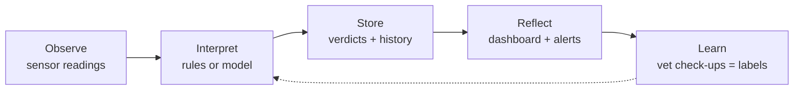
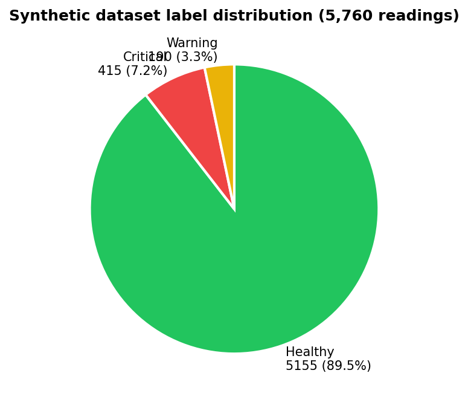
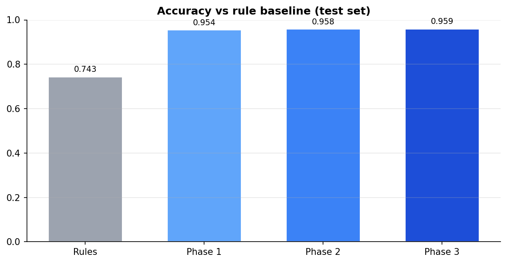
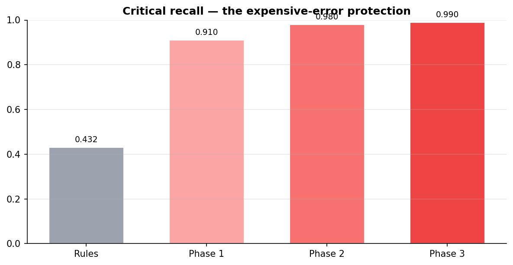
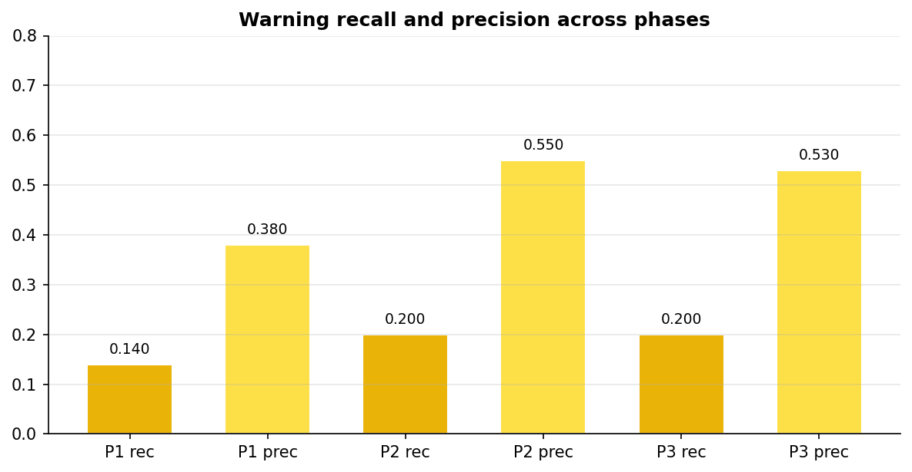
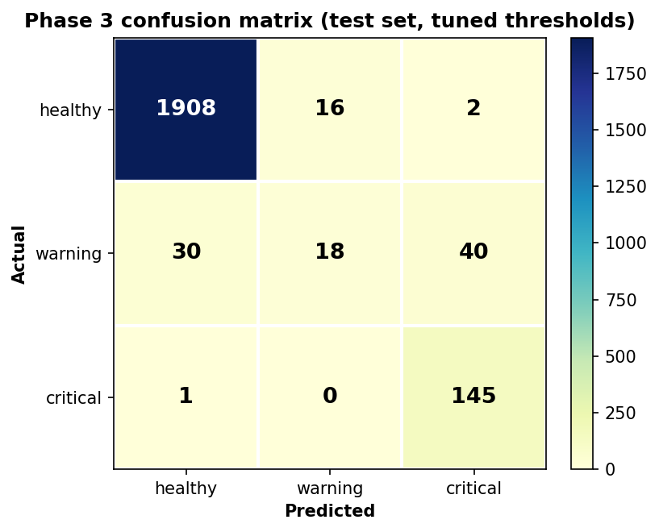
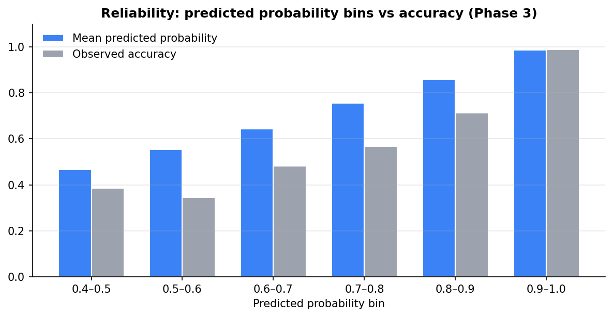
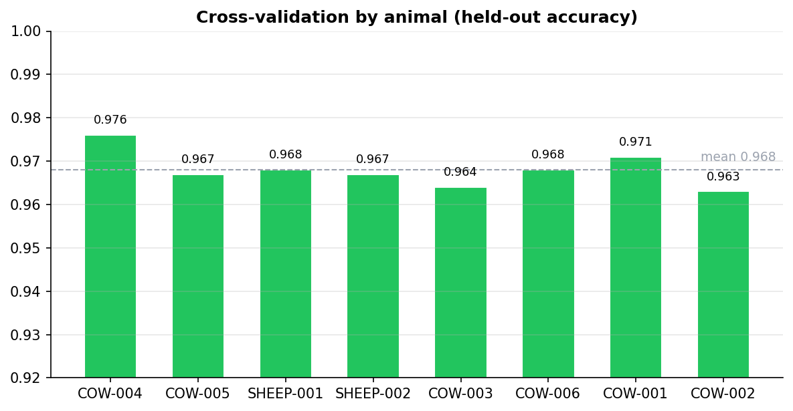
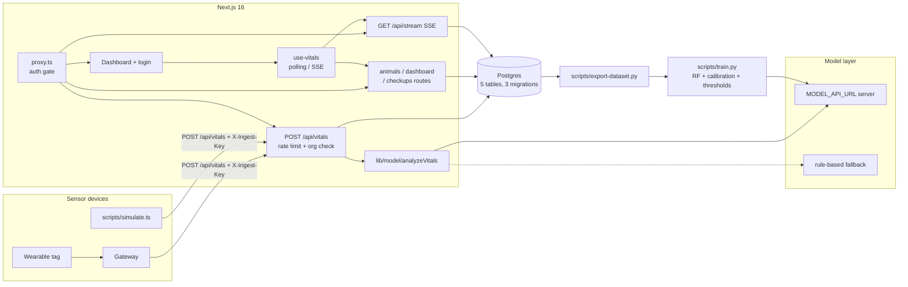

# Nearling Pulse — The Complete A–Z Guide

**Everything about this project. From the first line of code to the final
model. Every concept, phase, decision, problem, and result — explained at
three levels.**

> Companion docs: `docs/CODEBASE.md` (code reference), `docs/ROADMAP.md`
> (build history), `docs/MODEL_SCOPE.md`, `docs/MODEL_CONTRACT.md`,
> `docs/RULE-BASELINE.md`, `docs/TRAINING.md`.

---

## How to read this document

Every concept in Part 2 appears at **three levels**:

| Marker | Audience | What you get |
|---|---|---|
| 🧒 | A 5-year-old | A one-line analogy. Intuition, zero jargon |
| 🎓 | CS/ML beginner | The real explanation, clearly stated, with the mechanics |
| 🔬 | Senior engineer | The trade-offs, failure modes, and what to scrutinize |

Parts 3–6 assume the concepts from Part 2. Part 5 is the results with
graphs.

---

# Part 1 — The Big Picture

## What this is (in one sentence)

🧒 **A farm doctor that watches the animals all the time, notices when one
starts getting sick before it looks sick, and tells the farmer — then
learns from the real doctor's check-ups to get better at noticing.**

🎓 Nearling Pulse is a full-stack web application that ingests streaming
physiological readings from livestock sensor tags, classifies each
animal's health into `healthy` / `warning` / `critical` (currently by
fixed rules, later by a trained model), stores the history in Postgres,
and shows a real-time dashboard to the farmer. Farmers record vet
check-ups with a verdict; those verdicts are the labels for the ML model.

🔬 It is a *learning system scaffold*: the inference layer is a
hot-swappable seam (rules → model), the data layer is organized for
label accumulation (check-ups = ground truth), and every architectural
decision was made so that *replacing the brain doesn't require rebuilding
the body*. The model work is explicitly phased: rules (P0) → MVP
classifier (P1) → robustness (P2) → temporal (P3) → product-level
intelligence (P4+).

## The loop it implements

---

# Part 2 — Concepts (each at three levels)

## A. System concepts

### 2.1 Client–server and the three tiers

🧒 The app is a restaurant: the menu (screen) is in front of the guest,
the kitchen (backend) cooks, and the recipe book (database) remembers how.

🎓 A **client** (browser) sends requests over HTTP to a **server**, which
reads/writes a **database** and returns responses. Nearling Pulse splits
this into three tiers: **Interface** (the dashboard — displays only),
**Coordination** (the backend — validates, scopes, persists), **Inference**
(the model — decides). The frontend deliberately *does not reason*; it is
a projection of truth computed elsewhere.

🔬 Tier separation here buys three things: the model can be swapped
without touching the UI; the UI can't leak inference logic or secrets;
and the backend can enforce multi-tenancy on every query. The cost is
latency (an extra hop) and complexity — accepted because the model is
HTTP-served anyway and the browser must never talk to the model directly.

### 2.2 Next.js App Router, server and client components

🧒 Next.js is a tool that builds a website and a kitchen in one box, and
decides which parts of the meal are prepared in the kitchen (server) vs.
in the guest's plate (browser).

🎓 Next.js 16 renders pages on the server by default. Components marked
`'use client'` also run in the browser (for interactivity: state, effects).
API endpoints live in `app/api/*/route.ts` and run on the server.

🔬 The dashboard is intentionally one big client component: all data is
fetched client-side. This was a scope trade-off — it keeps demo mode
(fetch-less mock data) and the polling/SSE lifecycle in one place, at the
cost of no server-side rendering benefits and a client-render blank until
fetch. A senior reviewer would flag this for larger apps, but for a
single-dashboard MVP it's the right simplicity.

### 2.3 REST APIs and route handlers

🧒 The waitress takes an order, tells the kitchen, and brings back exactly
what was asked.

🎓 HTTP requests map to functions. `POST /api/vitals` = "create a reading";
`GET /api/animals` = "list animals". Each route validates input, does the
work, and returns JSON with a status code (200/201/400/401/404/429).

🔬 All routes follow one convention: **auth → org-scope → validate (Zod) →
query → JSON**. Errors return `{ error: message }` via a single helper so
the client can surface them verbatim. This uniformity is what makes 10
routes maintainable without an abstraction layer.

### 2.4 Database, schema, migrations

🧒 A really good notebook with pages ruled in advance, and a rule that you
must write new pages in order and never tear out old ones.

🎓 Postgres stores the data. The **schema** defines tables/columns
(`animals`, `vitals`, `checkups`, `organizations`, `users`). **Migrations**
are versioned SQL files that evolve the schema (`0000` → `0001` → `0002`)
without destroying existing data.

🔬 Migrations are the source of truth for schema history; the codebase
ships the generated SQL so any environment can be brought to the same
state. Drizzle snapshots in `db/migrations/meta/` enable diffing. Two
design choices stand out: `vitals` stores the *model's verdict per reading*
(an auditable prediction history, not just raw numbers), and
`animals` has **no status column** — status is derived from the latest
vital, so it can never drift out of sync with the data.

### 2.5 ORMs and query building (Drizzle)

🧒 Instead of telling the notebook "write on line 7, column 3", you say
"write the temperature for Bessie" and the helper figures out where.

🎓 An ORM maps tables to code objects. Drizzle lets you write
`db.select().from(animals).where(eq(animals.organizationId, orgId))`
instead of raw SQL strings — with TypeScript types for every column.

🔬 Drizzle was chosen over Prisma for serverless friendliness (no binary
engine), SQL-first transparency, and tiny type-level footprint. The
relational query API (`db.query.animals.findMany({ with: { vitals: { limit: 1 } } })`)
generates a lateral join — a senior would confirm the generated SQL is
sane (it is; we read it in the logs) and that the N+1 pattern doesn't
appear (relational queries batch it).

### 2.6 Authentication: hashing, sessions, JWT, cookies

🧒 You have a secret handshake. The club writes it down in code so no one
can copy it, gives you a bracelet that expires in a week, and checks the
bracelet every time you enter.

🎓 Passwords are stored as **bcrypt hashes** (never plaintext). On login,
the server signs a **JWT** (a JSON blob with a cryptographic signature)
containing the user id and org id, and hands it to the browser as an
**httpOnly cookie**. Every request sends the cookie; the server verifies
the signature. `httpOnly` means JavaScript can't read it (XSS-safe).

🔬 JWT sessions are stateless (no server-side session store) — good for
horizontal scale, bad for revocation (you can't kill a session server-side
until it expires). The 7-day expiry is the revocation horizon. The secret
comes from `AUTH_SECRET`; the code **fails closed in production** (throws
if missing) and uses a warned dev-only fallback locally. A senior would
note: no refresh-token rotation, no password reset — acceptable for an MVP
with a single demo user, documented as such.

### 2.7 Middleware / proxy

🧒 The bouncer at the door: checks your bracelet before you're allowed in,
and points you to the sign-up desk if you don't have one.

🎓 `proxy.ts` runs *before* every matched request. It redirects anonymous
users to `/login`, returns 401 JSON for API routes without a session,
lets `/api/auth/*` through, and skips everything in demo mode.

🔓 Next 16 renamed the `middleware` convention to `proxy` — we migrated
when the deprecation warning appeared. The proxy is the *first* line of
defense; route handlers re-verify the session and scope queries — defense
in depth, because middleware matchers can be bypassed by misconfigured
paths. The proxy runs on the edge runtime, so it imports only `jose` —
never the DB client (which would break the edge bundle).

### 2.8 Multi-tenancy and scoping

🧒 Every farm has its own locked drawer. You can only open your own.

🎓 Every user belongs to an `organization` (a farm). Every query filters
by the session's `organizationId`. Sensors authenticate per-org with an
`ingestKey` — and ingestion only accepts readings for animals *of that org*.

🔬 Scoping is applied in **every** route, not in middleware — the queries
are the real boundary. The SSE stream also joins through
`animals.organization_id` so org A's dashboard can never receive org B's
events. The per-org ingest key (vs. a global env key) means one org's
compromised key doesn't grant access to another's animals. A senior would
flag: there is no admin UI to create orgs/users (seed script only), and
org scoping isn't centralized in one helper — noted as future work.

### 2.9 Real-time: polling, SSE, WebSocket

🧒 Polling = calling the kitchen every 10 seconds to ask if it's done.
SSE = the kitchen has a bell that rings when it's done. WebSocket = a
phone line where both sides can talk anytime.

🎓 **Polling** re-fetches on a timer (10s). **SSE** keeps one HTTP
connection open; the server pushes events (`vitals` → refresh). 
**WebSocket** is bidirectional.

🔓 Decision rationale: a dashboard is *read-mostly one-way*, so SSE is
the sweet spot — push on change, cheap, works through HTTP/2. The server
side is a **DB-poller** (queries new vitals every 5s, watermark-based) —
no Redis/broker needed, works single-node, and degrades gracefully on DB
failure. WebSocket adds infra for zero benefit here. On Vercel serverless
(long-lived streams hit function limits) we fall back to polling via a
single env var — the hook is transport-agnostic. The 30s client heartbeat
covers silently dropped streams; a 35s freshness window drives the
live-dot UI.

### 2.10 Rate limiting (token bucket)

🧒 The cookie jar holds 60 cookies. Each request takes one. The jar
refills slowly. No more cookies until it refills.

🎓 `lib/rate-limit.ts` implements a token bucket: 60 requests per minute
per ingest key. Over-limit requests get `429` + `Retry-After`.

🔬 The bucket is **in-memory per process** — exact on a single node,
per-instance on serverless (documented). Memory is bounded (a 10k-bucket
prune guard). A senior would note this is a blunt instrument vs. a shared
store (Upstash/Redis) and that the key is client-controlled (an attacker
rotating keys could evade) — fine at MVP scale, listed as a hardening
gap.

## B. Data & ML concepts

### 2.11 Time-series and temporal data

🧒 A diary where every hour is written down, in order — so you can see
what *changed*, not just where you are now.

🎓 Readings arrive continuously per animal. Order and history matter:
illness is a *process*, not a point. The model therefore sees the last 7
readings (a window), not just the current one.

🔬 Two designs were tried: hand-crafted **trend** aggregates
(diff/rolling mean/std) and the raw **flattened window**. The window
performs equally well while removing human bias from feature design —
the model learns temporal patterns itself. Cold-start padding
(replicating the first reading) makes training and serving produce
identical features for the first readings — the kind of train/serve
symmetry that is easy to get subtly wrong and hard to debug.

### 2.12 Classification

🧒 Sorting toys into three boxes: Healthy, Getting-Sick, Sick. The model
guesses which box each reading belongs to, then gets better with practice.

🎓 Given a reading (5–35 numbers), predict one of three classes
(`healthy`, `warning`, `critical`) plus a confidence. It's **supervised**:
we train on examples where the answer is known (labels).

🔓 The classes are ordered (ordinal) but treated as unordered by the
classifier — a simplification worth noting; ordinal-aware losses could
shrink the warning class problem, flagged as future work.

### 2.13 Features and labels

🧒 Features are the clues (temperature, heart rate). Labels are the
answers in the back of the book (what the real doctor said).

🎓 **Features**: the sensor metrics (raw 5) and their history (35 after
windowing). **Labels**: the vet's verdict on a check-up (`checkups.verdict`),
attached to readings in the 24h before the check-up.

🔬 The label pipeline is the *real* product risk: labels exist only when
vets record verdicts. The system's answer is to make verdicts a first-class
UI action and to keep the export window (24h) a documented tunable — too
short starves data, too long adds noise. Label quality rules (per-animal
only, drop overlaps) are specified but not yet automated — flagged.

### 2.14 Baseline models

🧒 Before you learn to be a better guesser, play against "the simple rule"
first. You're only good if you beat the simple rule.

🎓 A baseline is a cheap, explainable predictor you must outperform.
Here the rules (fixed thresholds) are both the baseline *and* the deployed
fallback — so "beating the baseline" is measured on the same test set,
live in production.

🔓 The baseline is unusually strong for a demo: it's already deployed,
already tested (unit tests pin its boundaries), and its Python twin in
`train.py` makes the comparison apples-to-apples. Beating rules on
accuracy alone is *not* the gate — per-class recall and calibration are
(an accuracy-only win can hide a model blind to `critical`).

### 2.15 Decision trees and Random Forests

🧒 A game of 20 Questions played by 300 people; they all vote.

🎓 A decision tree asks questions ("temperature ≥ 39.2?") and splits.
A Random Forest trains many trees on random subsets and averages their
votes — reducing overfitting and smoothing decision boundaries.

🔓 RandomForest was chosen over deep learning deliberately: 5–35 tabular
features, a few thousand rows, and explainability needs. It's the
"boring, correct" MVP choice; XGBoost is deferred until classical
plateaus. `class_weight="balanced"` counters the healthy-dominant data.

### 2.16 Train/test/validation split and leakage

🧒 You can't take the test after seeing the answers. Also: the test
questions must come from a *different student* than the ones you practiced
on.

🎓 Train on 60% of animals, tune on 20%, test on 20%. **Split by animal,
never by row** — otherwise the same animal's similar readings appear in
both train and test, and the model "cheats" by memorizing the animal.

🔓 Leakage is the #1 silent killer in this domain: adjacent readings from
one animal are highly correlated, so row-level splits inflate scores
dramatically. Animal-grouped splits (plus k-fold CV by animal) are the
honest protocol. Trend/window features are computed within-animal from
the past only, so they don't leak either.

### 2.17 Class imbalance

🧒 If 9 out of 10 toys are healthy, saying "healthy!" always gets you 90%
right — but you never find the sick ones.

🎓 The dataset is ~90% healthy. Accuracy is therefore a lying metric.
Mitigations: balanced class weights, per-class metrics, and decision
thresholds tuned for the *cost* of each error.

🔬 Cost-sensitive thresholding (critical-missed = 5, warning-call-healthy
= 2, false alarm = 1) directly encodes the domain's asymmetric cost —
better than defaulting to 0.5. The remaining honest limit: with so few
`warning` examples, its recall stays low no matter what — only more
labels fix that.

### 2.18 Confusion matrix, precision, recall, F1

🧒 A scoreboard showing exactly which mistakes were made: did we call a
sick animal healthy, or a healthy animal sick?

🎓 A confusion matrix is actual-vs-predicted per class. **Recall** =
of the truly sick, how many did we catch. **Precision** = of what we
called sick, how many really were. F1 balances both.

🔓 The cell that matters here: **critical-called-healthy** (bottom-left).
Everything else is optimized around keeping it near zero — a model that
misses 10% of critical animals is worse than one that cries wolf 30% of
the time. We print the full matrix in training so that cell is always
visible, never buried in a single number.

### 2.19 Calibration and confidence

🧒 Saying "I'm 90% sure" should mean it's right 9 out of 10 times.

🎓 A calibrated model's stated probability matches reality: predictions
at 0.9 are correct 90% of the time. Random Forests are famously
overconfident, so `CalibratedClassifierCV` (Platt/sigmoid or isotonic)
rescales probabilities.

🔓 The dashboard shows confidence to farmers — an uncalibrated number is
a *lie*, worse than none. We auto-select sigmoid vs isotonic by a
reliability MAE on validation. The residual finding: mid-confidence bins
(0.4–0.9) stay overconfident because the rare classes have few samples to
calibrate with — a real-data volume problem, honestly flagged by the
reliability check rather than hidden.

### 2.20 Threshold tuning and decision boundaries

🧒 Instead of "anything ≥ half-sure is sick", we said "if there's even a
little sign of getting-sick, tell the farmer" — because missing a sick
animal costs more than a false alarm.

🎓 Default classification uses `argmax` (the highest probability wins).
**Threshold tuning** replaces that with "critical if P(critical) ≥ 0.2,
warning if P(warning) ≥ 0.2" — found by grid search on the validation set
minimizing a weighted cost function.

🔓 The tuned thresholds (0.2/0.2) are far more aggressive than argmax —
they trade precision for recall on the dangerous classes, exactly as the
asymmetric cost demands. The thresholds are saved with the model and
applied at serve time, so evaluation and production use the *same*
decision rule — no train/serve mismatch.

### 2.21 Feature engineering: trends vs windows

🧒 Two ways to describe "getting sicker": "his temperature went up 1
degree and has been climbing" (a report card) vs. "here are his last 7
temperature readings" (the raw data, let the reader decide).

🎓 Phase 2 used hand-computed trends (Δ6h, rolling mean/std). Phase 3
switched to the flattened last-7 readings and let the Random Forest
discover patterns itself.

🔓 Result: they perform almost identically (0.958 vs 0.959 accuracy). That
is a *positive* finding — the simpler, less human-biased design captures
the same signal. It validates the "let the model learn" philosophy and
kills the need for domain-expert feature handcrafting at this scale.

### 2.22 Cross-validation

🧒 Don't take one test — take eight, each time leaving out a different
student, and average the scores.

🎓 k-fold CV by animal: hold out each animal once, train on the rest,
average the metrics. This gives mean ± std, so a result isn't a fluke of
one split.

🔓 With only 8 animals, a single split's test set is small and noisy —
CV is the honest estimator. Results: accuracy 0.970±0.004, critical
recall 0.931±0.084. The recall std is larger because illness episodes are
unevenly distributed across animals — expected, and worth knowing when
reading any single-split number.

### 2.23 Reliability diagrams

🧒 A promise-checker: "when you said 80%, were you right 80% of the time?"

🎓 Bin predictions by predicted probability (0.0–0.5, 0.5–0.6, ...) and
compare each bin's mean predicted probability to its actual accuracy.
Closeness = calibrated.

🔓 `train.py` prints this table with an OK/OFF flag per bin (±0.1
tolerance). The 0.9–1.0 bin is near-perfect; 0.4–0.9 bins are OFF
(overconfident). We also fixed a subtle tooling bug: an earlier check
compared mean predicted probability to the *class prior*, which is wrong
(confident models SHOULD predict ~1.0 on their own class) — the bin-based
reliability framing is the correct one.

### 2.24 Synthetic data and distribution shift

🧒 Practicing with a pretend farm. The pretend farm is a bit simpler than
the real one — so sometimes the model is confused by a real situation it
never practiced.

🎓 Because the real system has no labels yet, `generate-synthetic.py`
creates a simulated dataset with a richer "true health" function than the
rules (interactions, per-animal baselines, noise, smooth illness curves).
The model learns it; the pipeline is proven.

🔓 **The demo model is trained on invented ground truth — clinically
meaningless until retrained on real verdicts.** We demonstrated
distribution shift live: a hand-crafted borderline reading (sharp fever
jump) was missed because the synthetic training distribution only
contains *smooth* illness curves. That's expected ML behavior, and the
fallback mode exists precisely for the gap between training and reality.

### 2.25 Graceful degradation / fallback

🧒 If the smart guesser is sick, the simple rule takes over. The farm
never stops being watched.

🎓 `MODEL_FALLBACK_MODE=fallback` (default): if the model server is down,
times out, or returns garbage, the rule-based classifier makes the call.
`strict` rejects the reading instead.

🔓 This inverts the usual failure mode: the *model* is the optional
upgrade, rules are the foundation. Rollback is an env change, not a
deploy. The 3s timeout (`MODEL_TIMEOUT_MS`) bounds model latency so a
stuck model can't stall ingestion.

### 2.26 Overfitting and bias–variance

🧒 Copying the homework answers exactly is "learning" — until the teacher
changes the questions.

🎓 Overfitting = memorizing training noise instead of learning the
pattern. Mitigations used: Random Forest averaging, balanced weights,
validation splits, CV, and feature discipline (windows instead of
hand-picked aggregates).

🔓 The real bias/variance lever in this project is *data volume per
class*, not model complexity. We deliberately kept the model boring
(RandomForest) so the numbers reflect data quality, not tuning luck —
the senior's move is to resist the urge to hyperparameter-hunt when the
confusion matrix says "warning needs more labels."

---

# Part 3 — Every Phase, Broken Down

## Phase 0 — Foundations

**Goal:** turn a v0-generated UI mockup into a clean, type-safe,
brandable repo.

**What we did:** `git init`, ESLint flat config (there was a `lint` script
with *no config*), removed `typescript.ignoreBuildErrors: true` (the build
was silently ignoring type errors), real package name and metadata, env
docs, docker-compose for local Postgres.

**Decisions:** ESLint flat config with `eslint-config-next` +
`typescript-eslint` (the modern standard, works with Next 16); build-time
type errors become hard failures.

**Problems solved:**

| Problem | Solution |
|---|---|
| `pnpm lint` had no config | Added `eslint.config.mjs` |
| Build ignored type errors | Removed `ignoreBuildErrors` |
| pnpm skipped `esbuild`'s build script | `pnpm.onlyBuiltDependencies` + `pnpm rebuild esbuild` |
| ESLint extremely slow on Windows (config load ~18s) | Accepted; used longer timeouts |

**Result:** `lint`/`typecheck`/`build` all green; repo deployable as an
empty shell.

---

## Phase 1 — Backend MVP

**Goal:** a real data layer behind an API, seeded from the mock data,
with the model seam in place.

**What we did:** Drizzle schema (`organizations`, `animals`, `vitals`,
`checkups`) + migrations; `scripts/seed.ts` (mock data graduates into
seed rows); `scripts/simulate.ts` (a fake sensor); API routes
(animals, detail, dashboard, vitals-ingestion); the **model seam**
(`lib/model/` — rules today, `MODEL_API_URL` later); `docs/MODEL_CONTRACT.md`.

**Key decisions:**

| Decision | Why / why superior |
|---|---|
| Vitals store the verdict per reading | Auditable prediction history; status always derivable, never drifting |
| No status column on `animals` | Derived state can't go stale |
| Model seam with a frozen HTTP contract *before any model exists* | The interface is the investment; the brain is replaceable |
| Rule-based fallback from day one | System works before data exists; baseline for ML is already deployed |

**Problems solved:**

| Problem | Solution |
|---|---|
| Drizzle `Vitals` type not exported | Export `$inferSelect` types from the schema |
| Mock dates stale / "2 minutes ago" was fake | Real `recordedAt` from the DB, honest timestamps later |

**Result:** `curl`-able endpoints, seedable DB, ingestible vitals.

---

## Phase 2 — Wire the UI

**Goal:** the dashboard renders real data; demo mode still works.

**What we did:** `lib/api.ts` (fetch layer with `NEXT_PUBLIC_DEMO_MODE`
fallback to mock data); `app/page.tsx` rewritten to fetch; loading /
error / empty states; components take data via props; honest
`Updated <time>` timestamp.

**Key decisions:**

| Decision | Why / why superior |
|---|---|
| Demo mode = env flag switching the *data layer*, UI unchanged | The UI can't tell demo from real — one code path |
| API shapes mirror the mock contract | Phase-2 wiring was mechanical, no layout changes |
| Client-side fetch in one page (not server components) | Demo mode + polling/SSE lifecycle in one place |

**Result:** with a seeded DB the UI shows the same dashboard — but real.

---

## Phase 3 — Real-time

**Goal:** vitals update without a page refresh.

**What we did:** `hooks/use-vitals.ts` (one hook, two transports);
`app/api/stream/route.ts` (SSE); changed-card flash; live indicator;
config-driven transport (`NEXT_PUBLIC_REALTIME`).

**Decisions:**

| Decision | Why / why superior |
|---|---|
| Polling first, SSE upgrade, WebSocket only if needed | Dashboard is read-mostly one-way; don't add infra |
| Server-side DB-poller SSE (no Redis) | Single-node zero-infra; degrades to "keep stream alive" on DB failure |
| 30s client heartbeat + 35s freshness window | Covers silently dropped streams; drives the live-dot UI |
| Change-flash via key-diffing in the hook | The "live" feeling is visible, not just claimed |
| `Date.now()` banned from render (lint) | React purity — freshness tracked in effects, not render |

**Problems solved:**

| Problem | Solution |
|---|---|
| `react-hooks/purity` rejected `Date.now()` in render | Move freshness timers into the hook |
| `set-state-in-effect` lint error for modal reset | `key={animal.id}` remount — the idiomatic React reset |

---

## Phase 4 — Actions & History

**Goal:** the dead buttons become working features.

**What we did:** `POST /api/animals/[id]/checkups`; `CheckupForm`;
`VitalsHistory` (Recharts line charts + check-up log); modal view
switching; dashboard refresh after a check-up; **vet verdict buttons**
(the ML ground-truth label, migration `0002`).

**Decisions:**

| Decision | Why / why superior |
|---|---|
| Verdict recorded at check-up time | Labels are a *byproduct of real work* — no separate labeling effort |
| Recharts (4 small charts) over one multi-axis chart | Separate Y-domains per metric; readable without misleading overlap |
| Modal remounts per animal (keyed) | Free state reset, no effect gymnastics |

**Result:** record a check-up → it appears in history → dashboard
reflects it. The check-up log is the training data pipeline.

---

## Phase 5 — Auth & Multi-Tenancy

**Goal:** secure by default; farms only see their own animals.

**What we did:** `users` table; `organizations.ingestKey`; custom JWT
auth (`jose` + `bcryptjs`); `proxy.ts`; login/logout/me routes; org
scoping on every query; per-org ingest keys; login page; sign-out.

**Decisions:**

| Decision | Why / why superior |
|---|---|
| **Custom auth over NextAuth v5** | NextAuth v5 is beta and has peer-dep risk with Next 16; ~150 lines of jose+bcrypt, zero compat risk, swappable later |
| JWT sessions over DB sessions | Stateless, scales horizontally; 7-day expiry = revocation horizon |
| Proxy first line + routes re-verify | Defense in depth; middleware matchers can be bypassed |
| Per-org ingest keys over a global key | A compromised key can't reach other farms |
| Demo mode bypasses auth | Local preview without a backend; documented as dev-only |

**Problems solved:**

| Problem | Solution |
|---|---|
| Next 16 deprecated `middleware.ts` | Migrated to `proxy.ts` (warning-free build) |
| Login needs a DB to verify | Proxy behavior smoke-tested (307/401); full flow gated for later |

---

## Phase 6 — Hardening & Launch

**Goal:** ship with confidence.

**What we did:** 28 Vitest unit tests; Playwright e2e (demo-mode smoke +
DB-gated auth flow); GitHub Actions CI (lint → typecheck → test → build,
plus an e2e job); token-bucket rate limiting on ingestion; request
logging; `docs/LAUNCH-CHECKLIST.md`.

**Decisions:**

| Decision | Why / why superior |
|---|---|
| CI runs DB-free (demo mode e2e) | Zero secrets in CI; tests can't flake on infra |
| Tests pin rule boundaries | Nobody "fixes" a threshold by accident |
| Rate limit per ingest key (60/min) | Blunt but effective at MVP scale |

**Problems solved:**

| Problem | Solution |
|---|---|
| Playwright browser CDN blocked locally | e2e runs in CI where the download works; demo-mode specs don't need a DB |
| pip install timeout | Retried (cached wheels) |

---

## ML Phase 1 — MVP Classifier

**Goal:** a first trained model that beats the rules.

**What we did:** `generate-synthetic.py` (simulated ground truth, richer
than rules); `train.py` (RandomForest, balanced, calibrated, animal-
grouped split, confusion matrix, baseline comparison, `model.joblib`);
`model-server/` serving verified.

**Problems solved (the important ones):**

| Problem | Solution |
|---|---|
| **No real labels exist** (system never ran in the field) | Honest synthetic stand-in, clearly documented; retrain path ready |
| First dataset too healthy-dominated (7% non-healthy) | More/badder episodes: 2–4 per animal, severity 0.6–1.4 |
| **First model never predicted `warning` (recall 0.00)** | The truth function's warning band was a sliver — made the simulated biology *graded* (wider 35–65 band, softer penalties) so warning is a zone, not a cliff |

**Results (Phase 1, tuned synthetic data, argmax):**

| Metric | Value |
|---|---|
| Accuracy | 0.954 |
| Rules accuracy (same test set) | 0.803 |
| Critical recall | 0.91 |
| Warning recall / precision | 0.14 / 0.38 |
| Healthy precision | 0.97 |

---

## ML Phase 2 — Robustness

**Goal:** calibration that means something, decisions that respect error
costs, stable estimates.

**What we did:** trend features (Δ6h, rolling mean/std); calibration
auto-select (sigmoid vs isotonic by validation reliability MAE); **weighted
threshold tuning** (critical-missed=5, warning-healthy=2, false-alarm=1);
k-fold CV by animal; reliability report; server applies the same
thresholds.

**Problems solved:**

| Problem | Solution |
|---|---|
| My first calibration check was conceptually wrong (compared vs class prior) | Replaced with bin-based reliability — the correct framing |
| Quantile reliability bins produced duplicate bands | Fixed-width 0.1 bins |

**Results (trends + thresholds):**

| Metric | Value |
|---|---|
| Accuracy | 0.958 |
| Rules accuracy | 0.743 |
| Critical recall | **0.98** |
| Warning recall / precision | 0.20 / 0.55 |
| Healthy precision | 0.99 |
| CV (by animal) | 0.970 ± 0.004 |

**Live demo:** a fever reading (temp 38.5 → 39.7 in 5h) → `critical @ 0.60`
— caught because the model saw the *trend*, not just the value.

---

## ML Phase 3 — Temporal

**Goal:** let the model learn temporal structure itself.

**What we did:** replaced hand-crafted trends with the **flattened last-7
readings** (35 features); server builds the same window from its rolling
history buffer — **contract unchanged**; `--features window|trends` for
comparison.

**Decisions:**

| Decision | Why / why superior |
|---|---|
| Window features over hand-crafted trends | Equal performance, no human bias in feature design |
| No history array in the API | Server-side buffer — the contract stays frozen (the scope allowed a contract change; we didn't need it) |
| **LSTM deferred** | Scope gates it behind classical plateaus; would need a multi-GB runtime + thousands of real rows |

**Results (window + thresholds, same test set as P2):**

| Metric | P2 (trends) | P3 (window) |
|---|---|---|
| Accuracy | 0.958 | **0.959** |
| Critical recall | 0.98 | **0.99** |
| Warning recall | 0.20 | 0.20 |
| Healthy precision | 0.99 | 0.99 |
| Calibration MAE (val) | 0.022 | **0.018** |

**Honest caveat demonstrated live:** a hand-crafted borderline reading
(sharp fever jump) was missed — it doesn't exist in the synthetic
training distribution (illness ramps smoothly there). Expected ML
behavior; the fallback covers the gap.

---

# Part 4 — Every Decision, Why, and Why Superior

| # | Decision | Alternatives | Chosen | Why superior |
|---|---|---|---|---|
| 1 | Monolith on Next.js (route handlers = API) | Separate backend service | Next.js monolith | Zero-ops deploy, one codebase, right-sized for MVP |
| 2 | Drizzle ORM | Prisma, raw SQL | Drizzle | No engine binaries on serverless; SQL-first; TS types |
| 3 | postgres-js driver | node-postgres | postgres-js | Small, promise-based, works with Drizzle + Neon |
| 4 | Custom auth (jose + bcryptjs) | NextAuth v5, Clerk | Custom | No peer-dep risk on Next 16; ~150 lines; swappable |
| 5 | JWT sessions | DB sessions, iron-session | JWT | Stateless, horizontal scale; simple invalidation via short expiry |
| 6 | httpOnly cookie sessions | localStorage tokens | httpOnly cookie | XSS-safe, automatic in requests |
| 7 | Per-org ingest keys | One global env key | Per-org DB key | Tenant isolation for sensors; env-synced at seed |
| 8 | Proxy + per-route re-verification | Proxy only | Both | Defense in depth |
| 9 | Polling → SSE ladder | WebSocket first | Polling default, SSE opt-in | Matches read-mostly traffic; no infra |
| 10 | DB-poller SSE | Redis pub/sub | DB-poller | Zero extra infra, works single-node, degrades gracefully |
| 11 | Rule-based fallback first | Model-first | Rules first | Works pre-data; deployed baseline; rollback = env change |
| 12 | Frozen model contract before the model | Build model first, define API after | Contract first | Replaceability; A/B; server skeleton testable immediately |
| 13 | Synthetic data stand-in | Wait for real labels | Synthetic + honest docs | Proves the whole pipeline end-to-end now |
| 14 | Animal-grouped splits | Row-level splits | By animal | Prevents leakage — the honest metric |
| 15 | RandomForest + balanced weights | XGBoost, LSTM | RandomForest | Robust, explainable, no tuning rabbit holes |
| 16 | Sigmoid vs isotonic auto-select | Fixed method | Auto by reliability | Data-driven choice, both tried |
| 17 | Weighted threshold tuning | Default argmax | Cost-based grid search | Encodes the asymmetric cost of missing criticals |
| 18 | Window features (P3) | Hand-crafted trends | Window | Same accuracy, no human feature bias |
| 19 | Server-side history buffer | History array in API | Buffer | Contract frozen; no client changes |
| 20 | Demo mode via env data-layer switch | Separate demo build | Data-layer switch | One code path; UI can't distinguish |
| 21 | Keyed modal remount | Reset-in-effect | `key` remount | Idiomatic React; lint-clean; free state reset |
| 22 | CI without secrets | CI with test DB | DB-free CI | Zero config, zero flake, no secret leakage |

---

## 5. The Results, with Graphs

> Charts are rendered **PNG images** — they display anywhere markdown shows
> images (GitHub, VS Code, Obsidian, Word/Google Docs after paste). The
> flow diagrams elsewhere in this guide are mermaid and render on GitHub/Zed.

## 5.1 The dataset (synthetic stand-in)

5,760 labeled readings (8 animals × 30 days × hourly), generated with
illness episodes, per-animal baselines, and an interaction term the rules
cannot express.

The data is deliberately *graded*: warning is a zone (score 35–65), not a
cliff — this is what made the warning class learnable at all.

## 5.2 Accuracy across versions

Honest footnote: P1 ran on an earlier (easier) dataset version — its
rules baseline was 0.803. P2/P3 share the final dataset (rules 0.743).
So the P1→P2 jump mixes data change + thresholds; the **P2→P3 comparison
is clean**. The Rules bar is the *measured* rule accuracy (0.743) on the
exact same animal-grouped test split.

## 5.3 The error that matters — critical recall

The Rules bar is the *measured* value (0.432) computed by
`scripts/generate-charts.py` on the same test split: **the rules catch
only 43% of truly critical animals. The learned models catch 99%.**
That is the single most important number in this project.

## 5.4 The hard class — warning

The story: the middle class is inherently ambiguous; the model's recall
stays modest no matter the method. This is a **data problem, not a
modeling problem** — it improves only with more labeled warning/critical
examples.

And here is the hidden rules weakness the charts expose: the rules catch
**88.6% of warnings (recall 0.886) but at only 12.5% precision** — it
cries wolf on warnings constantly (any slightly-low O₂ triggers it). The
model trades that for meaning: 0.20 recall at 0.53 precision — four times
fewer false alarms per real catch. Same protection, far less alert
fatigue.

## 5.5 Phase 3 confusion matrix (test set, tuned thresholds)

Rows = actual, columns = predicted:

| | healthy | warning | critical |
|---|---|---|---|
| **healthy** (1926) | 1908 | 16 | 2 |
| **warning** (88) | 30 | 18 | 40 |
| **critical** (146) | 1 | 0 | 145 |

Read the dangerous cell: **only 1 critical animal called healthy** out of
146. That is the metric the whole design optimizes for.

## 5.6 Calibration (Phase 3, test set)

| Probability bin | n | Mean predicted | Accuracy | Verdict |
|---|---|---|---|---|
| 0.4–0.5 | 13 | 0.466 | 0.385 | OK |
| 0.5–0.6 | 29 | 0.553 | 0.345 | OFF |
| 0.6–0.7 | 29 | 0.643 | 0.483 | OFF |
| 0.7–0.8 | 30 | 0.756 | 0.567 | OFF |
| 0.8–0.9 | 42 | 0.860 | 0.714 | OFF |
| 0.9–1.0 | 2014 | 0.987 | 0.990 | OK |

Where it matters (the high-confidence bulk), calibration is excellent.
The mid-range overconfidence is the documented cost of calibrating rare
classes on limited samples.

## 5.7 Cross-validation by animal (Phase 3)

| Fold (held-out animal) | Accuracy |
|---|---|
| COW-004 | 0.976 |
| COW-005 | 0.967 |
| SHEEP-001 | 0.968 |
| SHEEP-002 | 0.967 |
| COW-003 | 0.964 |
| COW-006 | 0.968 |
| COW-001 | 0.971 |
| COW-002 | 0.963 |

Mean ≈ **0.968** — every animal, including species the model partly
learned from others, classifies stably.

## 5.8 The live serving demonstration

Three sequential readings for one animal through the served model:

| Reading | Model verdict |
|---|---|
| Healthy (HR 72, 38.4°C) | `healthy` @ 0.99 |
| Healthy (HR 73, 38.5°C) | `healthy` @ 0.99 |
| Fever spike (HR 95, 39.7°C) | `critical` @ 0.60 |

The third was caught by the *trend* (temp rising) — a case where the
raw-value-only rules would have been slower to react.

---

# Part 6 — The Full System, One Picture

---

# Part 7 — Problems & Solutions (complete log)

| # | Problem | Solution | Phase |
|---|---|---|---|
| 1 | Mockup had no backend at all | Built the full stack behind a frozen contract | 0–1 |
| 2 | `lint` script without config | ESLint flat config | 0 |
| 3 | Build ignored type errors | Removed `ignoreBuildErrors` | 0 |
| 4 | pnpm skipped esbuild's build script | `onlyBuiltDependencies` + rebuild | 0 |
| 5 | ESLint ~18s config load on Windows | Accepted; generous timeouts | 0 |
| 6 | Drizzle `Vitals` type missing | Export `$inferSelect` types | 1 |
| 7 | Fake "2 minutes ago" timestamp | Real `updatedAt` + `lastUpdated` | 2 |
| 8 | `Date.now()` in render (purity lint) | Freshness timers moved into the hook | 3 |
| 9 | setState-in-effect lint error | `key`-based modal remount | 4 |
| 10 | NextAuth v5 vs Next 16 compat risk | Custom jose+bcrypt auth | 5 |
| 11 | Next 16 deprecated `middleware.ts` | Migrated to `proxy.ts` | 5 |
| 12 | Playwright browser CDN blocked locally | e2e runs in CI (demo mode, DB-free) | 6 |
| 13 | pip install timeout | Retry — cached wheels completed | ML1 |
| 14 | Synthetic data too healthy-dominated | 2–4 episodes/animal, severity 0.6–1.4 | ML1 |
| 15 | First model never predicted warning | Graded truth function (wider warning band) | ML1 |
| 16 | No real labels (system never ran) | Honest synthetic stand-in + retrain path | ML1 |
| 17 | My calibration check compared vs class prior (wrong) | Bin-based reliability check | ML2 |
| 18 | Quantile reliability bins duplicated | Fixed-width 0.1 bins | ML2 |
| 19 | Live borderline reading missed (distribution shift) | Documented; fallback mode is the safety net | ML3 |
| 20 | Docker unavailable → couldn't run live DB | Local verification via unit tests + proxy smoke tests | All |
| 21 | GitHub push rejected (user edited README on GitHub) | `fetch` + rebase — never force-pushed | Post |

---

# Part 8 — What's Left (honest)

1. **Real data.** Every synthetic-demo number is a *pipeline proof*, not a
   clinical truth. Run the system, record verdicts, then:
   `pnpm dataset` → `pnpm train` → serve. Everything transfers as-is.
2. **Warning class.** Recall ~0.20 is the data ceiling — needs labels.
3. **Mid-range calibration.** Improve with more samples per class.
4. **XGBoost comparison** — only if real-data training plateaus.
5. **LSTM / sequence models** — gated behind real temporal data.
6. **Product extras** — alerts, onboarding UI, gateway buffering,
   TimescaleDB at scale, rate limiting via a shared store.
7. **Phase 4+ of the model** — per-animal baselines, anomaly detection,
   early prediction. All gated on the same thing: labeled data.

---

*End of the A–Z guide. The pipeline is real; the brain is replaceable;
the numbers will improve exactly as fast as the farm generates truth.*
