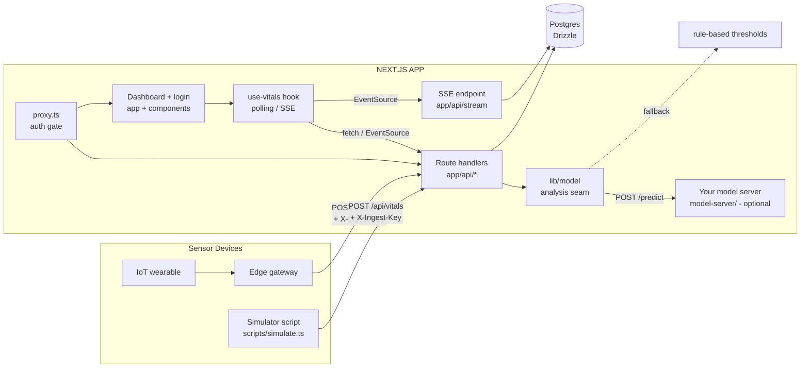
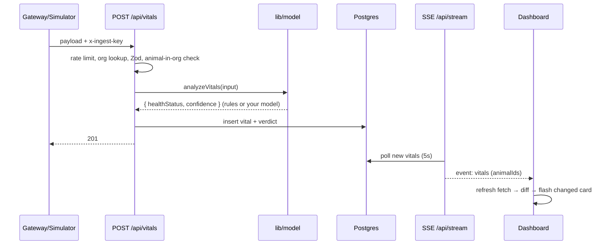

# Nearling Pulse — Codebase Reference

A detailed developer handbook for the Nearling Pulse livestock health
monitoring system. Read this to understand *how every part works*, not just
what it does. Companion docs: `README.md` (quickstart), `ROADMAP.md`
(build history), `docs/MODEL_CONTRACT.md` (ML contract), `docs/TRAINING.md`
(model training recipe), `docs/LAUNCH-CHECKLIST.md` (deployment).

---

## 1. Overview

Nearling Pulse is a full-stack web application that monitors livestock
health. Sensor tags attached to animals emit vital readings; a backend
ingests them, runs a health analysis (a rule-based classifier today, your
trained ML model later), stores everything in Postgres, and a dashboard
shows herd + per-animal health in real time. Farmers can record vet
check-ups; those check-ups (with a vet verdict) double as the training
labels for the ML model.

### Tech stack

| Layer | Technology | Version |
|---|---|---|
| Framework | Next.js (App Router, Turbopack) | 16.3.0 |
| UI | React | 19 |
| Language | TypeScript | 5.7 |
| Styling | Tailwind CSS (v4, CSS-first config) | 4.3 |
| UI kit | shadcn/ui "base-nova" + @base-ui/react | — |
| Icons | lucide-react | — |
| Charts | Recharts | 3.10 |
| Database | PostgreSQL + Drizzle ORM (postgres-js driver) | — |
| Validation | Zod | 3.x |
| Auth | Custom JWT sessions (jose) + bcryptjs | — |
| Tests | Vitest (unit), Playwright (e2e) | 4.x / 1.62 |
| Package manager | pnpm | 10 |

### System architecture



### The three tiers

1. **Frontend** (`app/`, `components/`, `hooks/`, `lib/api.ts`) — a
   client-rendered dashboard. It never talks to the model; it only reads
   stored verdicts through the API.
2. **Backend** (`app/api/*`, `lib/*`, `db/`) — Next.js route handlers that
   authenticate, scope by organization, run the analysis seam, and persist
   to Postgres.
3. **Model** (`lib/model/`, `model-server/`) — a pluggable inference layer.
   With `MODEL_API_URL` set, every reading is analyzed by your trained
   model over HTTP; otherwise (or on failure) deterministic rules run.
   You own the model; the seam and contract are already built.

---

## 2. Repository layout

```
nearlinq-pulsee/
├── app/                          # Next.js App Router
│   ├── api/
│   │   ├── animals/
│   │   │   ├── route.ts          # GET list animals + latest vital
│   │   │   └── [id]/
│   │   │       ├── route.ts      # GET detail + vitals history + checkups
│   │   │       └── checkups/
│   │   │           └── route.ts  # GET/POST check-ups
│   │   ├── auth/
│   │   │   ├── login/route.ts    # POST login (sets session cookie)
│   │   │   ├── logout/route.ts   # POST logout (clears cookie)
│   │   │   └── me/route.ts       # GET current session user
│   │   ├── dashboard/route.ts    # GET herd metrics
│   │   ├── stream/route.ts       # GET SSE stream (real-time pushes)
│   │   └── vitals/route.ts       # POST sensor ingestion
│   ├── login/page.tsx            # Sign-in page
│   ├── page.tsx                  # Dashboard (the whole UI)
│   ├── layout.tsx                # Root layout, metadata, analytics
│   └── globals.css               # Tailwind v4 + shadcn theme tokens
├── components/                   # Presentation components
│   ├── animal-card.tsx
│   ├── animal-detail-modal.tsx
│   ├── checkup-form.tsx
│   ├── herd-health-overview.tsx
│   ├── vitals-history.tsx
│   └── ui/button.tsx             # shadcn Button (NOT used by the app)
├── db/
│   ├── index.ts                  # Drizzle client (postgres-js)
│   ├── schema.ts                 # Tables, relations, inferred types
│   └── migrations/               # Generated SQL migrations (0000-0002)
├── e2e/                          # Playwright specs
│   ├── dashboard.spec.ts         # Demo-mode smoke tests (no DB)
│   └── auth.spec.ts              # Full auth flow (needs seeded DB)
├── hooks/
│   └── use-vitals.ts             # Data hook: fetch + polling + SSE
├── lib/
│   ├── api.ts                    # Client data layer + types + demo mode
│   ├── auth.ts                   # getSessionUser(request) helper
│   ├── http.ts                   # jsonError() helper
│   ├── livestock-data.ts         # Original mock data (seed/demo source)
│   ├── model/                    # The analysis seam (rules / your model)
│   │   ├── index.ts              # analyzeVitals() entry point
│   │   ├── rule-based.ts         # Threshold classifier (the baseline)
│   │   ├── http.ts               # POST /predict client for your model
│   │   └── types.ts              # ModelInput / ModelOutput contract
│   ├── rate-limit.ts             # Token-bucket limiter (ingestion)
│   ├── session.ts                # JWT sign/verify + cookie constants
│   ├── utils.ts                  # cn() class-merge helper
│   └── validation.ts             # Zod schemas (ingestion/checkup/login)
├── model-server/                 # Python serving skeleton (FastAPI)
│   ├── app.py                    # Loads your checkpoint, POST /predict
│   ├── README.md
│   └── requirements.txt
├── proxy.ts                      # Next 16 middleware: auth gate
├── scripts/
│   ├── seed.ts                   # DB seed: org + user + mock animals
│   ├── simulate.ts               # Emits fake vitals to the API
│   ├── export-dataset.py         # Vitals + verdicts → labeled CSV
│   ├── train.py                  # Trains the RandomForest, exports .joblib
│   └── requirements.txt          # Python deps for the ML scripts
├── tests/                        # Vitest unit tests (28 total)
├── .github/workflows/ci.yml      # CI: lint, typecheck, test, build, e2e
├── .env.example                  # Documented environment variables
├── docker-compose.yml            # Local dev Postgres (optional)
├── drizzle.config.ts             # Drizzle Kit config
├── eslint.config.mjs             # Flat ESLint config (Next + TS)
├── next.config.mjs               # Next config (images unoptimized)
├── playwright.config.ts          # E2E config (demo-mode webServer)
├── vitest.config.mts             # Unit test config (@ alias)
└── package.json                  # Scripts + dependencies
```

---

## 3. Frontend

### 3.1 `app/page.tsx` — the dashboard

The entire UI is one page. It is a **client component** (`'use client'`):
all data arrives via client-side fetches from the API (there are no server
components — this was a deliberate scope choice so demo mode and the fetch
lifecycle live in one place).

**State:**

| State | Type | Purpose |
|---|---|---|
| `selectedAnimal` | `AnimalWithStatus \| null` | Which animal's modal is open |
| `filter` | `'all' \| 'healthy' \| 'warning' \| 'critical'` | Grid filter |
| `animals` / `metrics` / `loading` / `error` / `lastUpdated` / `changedIds` / `isFresh` | from `useVitals()` | All data + status |

**Rendering states** (in priority order):

1. **Error** (`error && animals.length === 0`) — full error panel with the
   message + a Retry button (`refresh()`).
2. **Loading** — skeleton cards (`animate-pulse`) + `SkeletonOverview`.
3. **Empty** (`animals.length === 0`) — "No animals in the database yet"
   with guidance to run `pnpm seed` or enable demo mode.
4. **Data** — the grid; plus a small "No animals found with X status"
   note when the filter matches nothing.

**Header**: total animal count, a live dot (pulsing green while `isFresh`,
gray when stale) + the real `lastUpdated` time, and a **Sign out** button
that is hidden in demo mode (`isDemoMode` from `lib/api.ts`). Sign-out
POSTs `/api/auth/logout`, then pushes to `/login`.

**Keyed modal**: `<AnimalDetailModal key={selectedAnimal?.id ?? 'closed'} ... />`
— React remounts the modal when the animal changes, which resets its
transient state (view, form, history) for free. This is the idiomatic
alternative to a reset-in-effect (the linter rejects setState-in-effect).

### 3.2 `hooks/use-vitals.ts` — the data acquisition hook

The single source of all dashboard data. Three effects:

1. **Load effect** (depends on `tick`) — fires on mount, on manual
   `refresh()`, and whenever `tick` changes. Fetches animals + dashboard
   in parallel (`Promise.all`), then:
   - computes `changedIds` by diffing a per-animal key
     (`lastCheckup|healthStatus|heartRate|temperature|oxygenLevel`)
     against the previous fetch (skipped on first load — otherwise every
     card would flash on mount), clears them after 2.5s
   - sets `isFresh = true` and schedules a staleness timer
     (`FRESH_WINDOW_MS = 35s`)
   - on error: sets `error` but **keeps last good data** (a failed poll
     doesn't blank the dashboard)
2. **Polling effect** — every `intervalMs` (default 10s) increments
   `tick`. Skipped in demo mode (mock data never changes) and in SSE mode.
3. **SSE effect** — opens `EventSource('/api/stream')`; a `vitals` event
   increments `tick` (immediate refresh). A 30s heartbeat interval covers
   silently dropped streams. Cleanup closes the EventSource.

The change-detection design means the "live" experience is visible: when
`pnpm simulate` pushes a reading, the next fetch diffs the data, and the
affected card flashes with a blue ring for 2.5s.

### 3.3 `lib/api.ts` — client data layer

- **Types** mirror the API contracts (and the original mock shape):
  `AnimalWithStatus`, `HerdMetrics`, `DashboardMetrics`, `VitalReading`,
  `Checkup`, `AnimalDetail`, `CheckupInput`.
- **`DEMO_MODE`** = `process.env.NEXT_PUBLIC_DEMO_MODE === 'true'` (baked
  at build time, exported as `isDemoMode`). In demo mode the fetchers
  return data derived from `lib/livestock-data.ts` instead of hitting the
  network — so the whole UI works with zero backend.
- **Functions**: `fetchAnimals()` → `GET /api/animals`; `fetchDashboard()`
  → `GET /api/dashboard` (maps `avgTemperature` → `avgTemp` to match the
  mock metric name); `fetchAnimalDetail(id)` → `GET /api/animals/[id]`;
  `createCheckup(id, input)` → `POST /api/animals/[id]/checkups` (throws
  with the API's `error` message on failure).
- **`fetchJson<T>`** — shared helper: non-OK responses throw an `Error`
  with the server's `{ error }` message.

### 3.4 Components

**`components/herd-health-overview.tsx`** — takes `metrics: HerdMetrics`
via props (the only prop). Renders: overall health percentage gauge
(SVG circle with `strokeDasharray` proportional to the healthy ratio),
three status count cards (Healthy/Warning/Critical with % of herd),
average vitals cards (heart rate, temperature, O₂), and an alert banner
that prefers the critical message over the warning message. Computes
`healthPercentage` locally (guarding division by zero).

**`components/animal-card.tsx`** — a `<button>` card showing name, ID, a
colored status dot, a hand-drawn SVG animal icon (cow / sheep branches),
heart rate, temperature, O₂, and a status label. Handles three data
states: `healthy` (green), `warning` (yellow), `critical` (red), and
`unknown`/missing (gray, label "No data", nulls render as `—`).
Optional `highlight` prop adds a blue ring when the reading just changed.

**`components/animal-detail-modal.tsx`** — bottom-sheet on mobile,
centered dialog on desktop (`max-w-2xl`, scrollable). Two views:
- **details** (default): large SVG, health bar (width 95/70/40/0 by
  status), four vital tiles (heart rate, pulse, temperature, O₂),
  digestive score + weight, location, last check-up date (formatted).
- **history**: renders `<VitalsHistory />`.
Actions row: **Record Check-up** (toggles `<CheckupForm />`) and
**View History** (switches view) / **Back to details**. When a check-up
is recorded it bumps `historyKey` (forces the history refetch) and calls
`onCheckupRecorded` (the page's `refresh()`). The modal is keyed by
animal id from the page, so state resets on animal switch.

**`components/checkup-form.tsx`** — inline form: weight (number), performed
by (text), notes (textarea), and a **vet verdict** toggle
(Healthy/Warning/Critical — optional, this is the ML ground-truth label).
Submits via `createCheckup`; shows error / success messages; resets
fields on success; `onRecorded(checkup)` bubbles the created row up.

**`components/vitals-history.tsx`** — fetches `AnimalDetail` itself on
mount (and on `refreshKey` change). Renders:
- **Vitals charts**: four Recharts line charts (heart rate, temperature,
  O₂, digest score) from readings ordered oldest → newest, each in a
  fixed-height `ResponsiveContainer` with a tooltip. `isAnimationActive={false}`
  keeps live updates snappy.
- **Check-up log**: reverse-chronological list; each entry shows the date,
  a verdict badge (green/yellow/red), weight, performer, and notes.
- Loading skeleton and error state included.

**`components/ui/button.tsx`** — shadcn-generated Button (Base UI
primitive + CVA variants). **Currently unused by the app** (the UI uses
plain `<button>` elements with inline Tailwind). Kept as the standard
component if you migrate.

**`app/login/page.tsx`** — centered sign-in card: email + password →
`POST /api/auth/login` → on success `router.push('/')` +
`router.refresh()`. Shows the server's error message on failure. Includes
a hint with the seeded demo credentials.

### 3.5 `app/layout.tsx` + `globals.css`

- Layout: HTML shell, metadata ("Nearling Pulse"), icons from `public/`,
  and `@vercel/analytics` rendered only in production.
- Globals: Tailwind v4 CSS-first setup (`@import 'tailwindcss'`,
  `tw-animate-css`, `shadcn/tailwind.css`), shadcn theme tokens (oklch
  colors, radii, light/dark + `prefers-color-scheme` blocks).

---

## 4. Backend

### 4.1 Conventions used by every route

- **Auth**: `const user = await getSessionUser(request); if (!user) return jsonError(401, 'Unauthorized')` — session comes from the cookie, verified via JWT (`lib/auth.ts`).
- **Org scoping**: every query filters by `user.orgId` — e.g.
  `where: and(eq(animals.id, id), eq(animals.organizationId, user.orgId))`.
  This is the multi-tenancy boundary.
- **Errors**: `jsonError(status, message, extra?)` from `lib/http.ts`
  returns `{ error: message, ...extra }`.
- **Validation**: `request.json().catch(() => null)` → Zod `safeParse` →
  `400` with `issues` on failure.
- **Dynamic**: route handlers are dynamic by default in Next 16.

### 4.2 Route reference

#### `POST /api/vitals` — sensor ingestion (no session; X-Ingest-Key)

1. `__pruneBuckets()` bounds the rate-limiter map.
2. **Rate limit** keyed by the ingest key (60 req/min, `429` + `Retry-After`).
3. Look up the organization by `x-ingest-key` (unique column) → `401` if unknown.
4. Zod-validate the payload (`vitalsIngestSchema`).
5. Check the animal exists **and belongs to that org** → `404` otherwise.
6. `analyzeVitals(input)` runs the model seam → verdict + confidence.
7. Insert the vital row (numeric columns stored as strings; optional
   `recordedAt` uses the DB default `now()`).
8. Respond `201` with `{ vital, analysis }`.

#### `GET /api/animals` — list (session)

Queries animals of the user's org with their **latest** vital via a Drizzle
relational query (`with: { vitals: { orderBy: desc(recordedAt), limit: 1 } }`
— generates a lateral join). Maps to the `AnimalWithStatus` shape
(`age` derived from `birthDate`, nulls preserved, `healthStatus` defaults
to `'unknown'` when no vital exists).

#### `GET /api/animals/[id]` — detail (session)

Scoped lookup (404 if the animal isn't in the user's org). Returns
`{ animal, vitals, checkups }` with vitals + checkups **mapped to the
chart-friendly contract** (numeric temperature/confidence, ISO strings,
`verdict` included). `?limit=N` caps vitals history (1–500, default 100).

#### `GET/POST /api/animals/[id]/checkups` — check-ups (session)

- `GET`: scoped animal check, then all checkups newest-first.
- `POST`: scoped animal check → Zod `checkupSchema` (performedBy ≤120,
  weightKg 0–2000, notes ≤2000, optional `verdict` enum) → insert →
  if `weightKg` was provided, also update `animals.weightKg` → `201`.

#### `GET /api/dashboard` — herd metrics (session)

Scoped animals + latest vitals; computes `total`, `healthy`/`warning`/
`critical` counts, `healthPercentage` (healthy/total), averages of the
latest readings (`avgTemperature` rounded to 1 dp), and `updatedAt`.
Mirrors the shape the old mock `getHealthMetrics()` returned, so the
frontend mapping is trivial.

#### `GET /api/stream` — SSE (session)

`401` without a session. Otherwise opens a `ReadableStream`:
- sends `event: message, data: {"type":"connected"}` immediately
- every 5s polls `vitals` joined to `animals` **where org = session.org
  and recorded_at > since** (a moving watermark, initialized to
  connect-time − 5s)
- new rows → `event: vitals, data: { animalIds, count }`; none → `: ping`
  keepalive comment
- DB errors are swallowed (stream stays alive; the client's polling/heartbeat
  covers gaps)
- `request.signal` abort → clears the interval

#### `POST /api/auth/login` — login (public)

Zod `loginSchema` → look up user by email → `bcrypt.compareSync` →
`401 "invalid email or password"` on mismatch → create JWT →
`Set-Cookie: nearling_session` (httpOnly, sameSite=lax, secure in
production, 7-day maxAge). Returns `{ user }`.

#### `POST /api/auth/logout` — logout (public)

Clears the cookie (`maxAge: 0`).

#### `GET /api/auth/me` — session check (public, but requires cookie)

Returns `{ user }` or `401`.

### 4.3 Server helpers

- **`lib/session.ts`** — JWT via `jose` (HS256). `createSession(user)`
  signs `{ sub, orgId, email, name }` with a 7-day expiry; `verifySession`
  verifies and returns `SessionUser | null`. Secret from `AUTH_SECRET`;
  in production a missing secret **throws** (fail-closed); in dev a
  warn-and-fallback dev secret keeps `pnpm dev` working.
- **`lib/auth.ts`** — `getSessionUser(request)` reads the cookie and
  verifies it. The single entry point for route-level auth.
- **`lib/http.ts`** — `jsonError(status, message, extra?)`.
- **`lib/rate-limit.ts`** — token-bucket limiter (`rateLimit(key, max=60,
  windowMs=60_000)`). In-memory `Map` with a 10k-bucket prune guard
  (`__pruneBuckets`). Per-instance semantics: exact on a single node,
  per-instance on serverless (documented in the launch checklist).
- **`lib/validation.ts`** — `vitalsIngestSchema` (uuid animalId; heart
  rate/pulse 20–250; temperature 30–45; O₂ 50–100; digest 0–100; optional
  ISO `recordedAt`), `checkupSchema`, `loginSchema`.

---

## 5. Database

### 5.1 Schema (`db/schema.ts`)

Five tables (all UUID PKs with `defaultRandom()`, all timestamps
timezone-aware with `defaultNow()`):

| Table | Columns | Notes |
|---|---|---|
| `organizations` | `id`, `name`, `ingestKey` (unique), `createdAt` | A farm. `ingestKey` is the sensor API key for that farm |
| `users` | `id`, `organizationId` (FK→orgs, cascade), `email` (unique), `name`, `passwordHash`, `createdAt` | Login identities, always bound to one org |
| `animals` | `id`, `organizationId` (FK, cascade), `name`, `type` (text: cow/sheep/goat/pig), `birthDate`, `weightKg` (numeric 7,2), `location`, `createdAt` | No status column — status is derived from the latest vital |
| `vitals` | `id`, `animalId` (FK, cascade), `heartRate`, `pulse`, `temperatureC` (numeric 4,1), `oxygenPct`, `digestScore`, `healthStatus` (text), `confidence` (numeric 4,3), `recordedAt` | **`healthStatus` + `confidence` are the model's output** stored per reading — a full prediction history. Index `idx_vitals_animal_time (animal_id, recorded_at)` |
| `checkups` | `id`, `animalId` (FK, cascade), `performedBy`, `weightKg`, `notes`, `verdict` (text, nullable), `performedAt` | `verdict` = vet's assessment, the ML ground truth |

Relations (Drizzle `relations()`): org→animals/users; animal→org/vitals/
checkups; vital→animal; checkup→animal. These power `db.query.*` relational
queries used in the animals and dashboard routes.

Inferred types exported: `Organization`, `User`, `Animal`, `Vitals`,
`Checkup`.

### 5.2 Migrations (`db/migrations/`)

- `0000_amused_expediter.sql` — base tables (organizations, animals,
  vitals, checkups)
- `0001_military_tigra.sql` — `users` table + `organizations.ingest_key`
- `0002_solid_anita_blake.sql` — `checkups.verdict`

Generate new ones with `pnpm db:generate` (reads `drizzle.config.ts`),
apply with `pnpm db:migrate` or `pnpm db:push`. Drizzle snapshots live in
`db/migrations/meta/`.

### 5.3 Client (`db/index.ts`, `drizzle.config.ts`)

`db/index.ts` creates a `postgres-js` client (`max: 1`, `prepare: false`
— safe for Neon/serverless) and exports `db` + everything from the schema.
Falls back to the docker-compose Postgres URL with a warning when
`DATABASE_URL` is unset (so dev works out of the box if you start the
container). `drizzle.config.ts` points at `./db/schema.ts`, output
`./db/migrations`, dialect `postgresql`.

---

## 6. The model seam

### 6.1 `lib/model/`

- **`types.ts`** — the contract: `ModelInput` (one vital reading: the 5
  numeric features + `animalId` + `recordedAt`) and `ModelOutput`
  (`healthStatus` enum, `confidence` 0–1, optional `score`/`reasons`).
- **`rule-based.ts`** — the deterministic baseline (`RULE_THRESHOLDS`:
  temp ≥39.8 critical / ≥39.2 warning; HR ≥100 / ≥85; O₂ ≤90 / ≤95;
  digest ≤60 / ≤80). Critical flags win over warning; emits human-readable
  `reasons`; confidence 0.9/0.8/0.7 by status; score 90/70/40.
- **`http.ts`** — the client for **your** model: `POST {MODEL_API_URL}/predict`
  with the `ModelInput` JSON; validates the response with Zod
  (`modelOutputSchema`); throws `ModelClientError` on non-OK, invalid
  output, or timeout (`MODEL_TIMEOUT_MS`, default 3s).
- **`index.ts`** — `analyzeVitals(input)`: the one function the backend
  calls. With `MODEL_API_URL` set → try the model; on failure, either
  rethrow (`MODEL_FALLBACK_MODE=strict`) or warn + fall back to rules
  (default `fallback`). Without `MODEL_API_URL` → rules directly.

The full contract your model must satisfy is in `docs/MODEL_CONTRACT.md`.

### 6.2 `model-server/` (Python, yours to extend)

A FastAPI skeleton that **loads your trained checkpoint and serves it** —
you own the training:
- `MODEL_PATH=model.joblib uvicorn app:app --port 8000`
- `POST /predict` expects the `ModelInput` shape, runs
  `model.predict(X)` (sklearn-style; labels 0/1/2 → healthy/warning/
  critical), uses `predict_proba` max as confidence (1.0 if absent),
  returns `ModelOutput`.
- `GET /health` reports whether a model is loaded; `501` if not.
- Anything serving the documented contract works (MLflow, ONNX Runtime,
  PyTorch service, ...).

---

## 7. Real-time

Two transports, one hook surface (`useVitals({ realtime })`):

- **Polling** (default; `NEXT_PUBLIC_REALTIME=polling`): re-fetch
  `/api/animals` + `/api/dashboard` every 10s. Works everywhere,
  including Vercel serverless.
- **SSE** (`NEXT_PUBLIC_REALTIME=sse`): the browser holds one
  `EventSource` on `/api/stream`; the server watches Postgres (5s poll,
  org-scoped, watermark-based) and pushes `vitals` events with affected
  animal ids; the hook refreshes immediately. A 30s client heartbeat
  guards against dropped connections. Best on a single-node deployment —
  on serverless, long-lived streams hit function limits, so polling is
  the documented choice there.

Demo mode skips both (mock data is static).

---

## 8. Auth & multi-tenancy

- **Sessions**: `POST /api/auth/login` sets an httpOnly cookie containing
  a signed JWT (`nearling_session`, 7 days). No server-side session store
  — the JWT is self-contained.
- **`proxy.ts`** (Next 16 middleware): runs before every matched request.
  - demo mode (`NEXT_PUBLIC_DEMO_MODE=true`) → pass everything through
  - `/api/auth/*` → public
  - other `/api/*` → `401` JSON without a valid session
  - `/login` → redirect to `/` if already authenticated
  - everything else → redirect to `/login` without a session
  - logs one line per request (`method path auth|anon`)
  - matcher excludes static assets/favicons
- **Scoping**: every route re-verifies the session and filters queries by
  `user.orgId`. The proxy is the first line; the routes are the real
  boundary (defense in depth).
- **Sensors**: not users — they authenticate with the organization's
  `ingestKey` (stored in the DB, set at seed time from
  `VITALS_INGEST_KEY`). Ingestion validates that the target animal
  belongs to the org that owns the key.

---

## 9. Scripts

| Script | Command | What it does |
|---|---|---|
| Seed | `pnpm seed` | Creates/updates the demo org (name `Demo Farm`, ingest key synced to `VITALS_INGEST_KEY`), the demo user (`SEED_EMAIL`/`SEED_PASSWORD`, bcrypt-hashed), and inserts the 8 mock animals with one initial vital each (analyzed by `ruleBasedAnalyze`). Idempotent: skips animals that already exist by name, and re-syncs the org's key |
| Simulator | `pnpm simulate` | Machine-login (`/api/auth/login` with demo credentials) → session cookie → `GET /api/animals` → every 5s POSTs a jittered reading for a random animal with the org's `x-ingest-key`. The reference implementation for a real gateway |
| Dataset export | `pnpm dataset` | Python: joins `checkups` (with verdict) + `animals` + `vitals`, taking readings within a 24h window before each verdict-bearing check-up → `scripts/dataset.csv` (features + label). Needs `DATABASE_URL` + `pip install -r scripts/requirements.txt` |
| Train | `pnpm train` | Python: loads the CSV, splits **by animal** (80/20, seeded), trains a balanced RandomForest (300 trees), prints confusion matrix + classification report, compares accuracy against a Python port of the rule-based baseline, saves `model-server/model.joblib` |

---

## 10. Tests

**Unit (Vitest, `pnpm test`, 28 tests, no DB):**

| File | Covers |
|---|---|
| `tests/rule-based.test.ts` (10) | Each threshold boundary (inclusive at warning/critical, healthy below), critical-wins-over-warning, reasons populated, normal → healthy |
| `tests/validation.test.ts` (11) | Zod schemas: valid/invalid vitals payloads (uuid, ranges, ISO date), checkups (verdict enum, weight), login (email format, empty password) |
| `tests/session.test.ts` (3) | JWT round-trip, tampered token → null, garbage → null |
| `tests/model-http.test.ts` (4) | Model client with stubbed fetch: valid output, invalid output rejected, error status throws, missing `MODEL_API_URL` |

**E2E (Playwright, `pnpm test:e2e`, browser required):**

- `e2e/dashboard.spec.ts` (3 tests) — runs in **demo mode** (the config's
  `webServer` starts `pnpm dev` with `NEXT_PUBLIC_DEMO_MODE=true`): dashboard
  renders, filter narrows the grid, modal → history → back.
- `e2e/auth.spec.ts` (1 test) — full login → dashboard → sign-out flow,
  **skipped unless `E2E_WITH_DB=true`** (needs a seeded database).

---

## 11. CI & configuration

### 11.1 `.github/workflows/ci.yml`

Two jobs, both DB-free:
- **ci**: pnpm install (frozen lockfile) → lint → typecheck → unit tests → build
- **e2e**: install → `playwright install --with-deps chromium` → `pnpm test:e2e` (demo mode)

### 11.2 `package.json`

Scripts: `dev`, `build`, `start`, `lint` (eslint flat config), `typecheck`
(`tsc --noEmit`), `test` (vitest run), `test:e2e` (playwright), `db:generate`
/ `db:migrate` / `db:push` (drizzle-kit), `seed`, `simulate`, `dataset`,
`train`.

Key dependencies: `next@16.3`, `react@19`, `drizzle-orm` + `postgres`,
`zod`, `jose`, `bcryptjs`, `recharts`, `lucide-react`, `@base-ui/react`,
`@vercel/analytics`, `dotenv`, `class-variance-authority`, `clsx`,
`tailwind-merge`, `tw-animate-css`. Dev: `typescript`, `eslint@9` +
`eslint-config-next` + `typescript-eslint`, `tailwindcss@4`,
`drizzle-kit`, `tsx`, `vitest`, `@playwright/test`.

### 11.3 Key config files

| File | What it does |
|---|---|
| `next.config.mjs` | `images.unoptimized: true` (local assets). Type-checking is enforced at build (no `ignoreBuildErrors`) |
| `tsconfig.json` | Strict mode, `@/*` → project root alias, Next plugin |
| `eslint.config.mjs` | Flat config: `eslint-config-next` core-web-vitals + typescript, ignores `.next`, `model-server/` |
| `drizzle.config.ts` | Postgres dialect, migrations to `db/migrations`, env-or-local URL |
| `vitest.config.mts` | Node environment, `@` alias, `tests/**/*.test.ts` |
| `playwright.config.ts` | Chromium project, `webServer` = `pnpm dev` with demo mode env, baseURL `:3000` |
| `docker-compose.yml` | Local Postgres 16 (`nearling`/`nearling_dev`), port 5432, named volume |
| `.env.example` | Documented env vars (see §13) |

---

## 12. End-to-end flows

### Sensor reading → dashboard



### Farmer session

```
GET /  → proxy: no cookie → 307 → /login
/login → POST /api/auth/login (bcrypt verify) → Set-Cookie
GET /  → proxy: valid cookie → dashboard
        useVitals fetches /api/animals + /api/dashboard (org-scoped)
        Sign out → POST /api/auth/logout → cookie cleared → /login
```

### Check-up → label

```
Dashboard → open modal → Record Check-up → verdict toggle
  → POST /api/animals/[id]/checkups { weightKg, notes, verdict }
  → row inserted (historyKey++ → history refetch) → onCheckupRecorded → dashboard refresh
Later: pnpm dataset exports readings before verdict-bearing checkups → pnpm train
```

### Activating your model

```
pnpm dataset → pnpm train → model-server/model.joblib
cd model-server && MODEL_PATH=model.joblib uvicorn app:app --port 8000
.env: MODEL_API_URL=http://localhost:8000  (MODEL_FALLBACK_MODE=fallback first)
Restart app → every /api/vitals call now POSTs to your model; rules only on failure
```

---

## 13. Environment variables

| Variable | Used by | Meaning |
|---|---|---|
| `DATABASE_URL` | `db/index.ts`, scripts | Postgres connection string (Neon, docker-compose, ...) |
| `AUTH_SECRET` | `lib/session.ts` | JWT signing secret. **Required in production** (build/runtime throws without it). `openssl rand -base64 32` |
| `VITALS_INGEST_KEY` | `scripts/seed.ts` + `scripts/simulate.ts` | The demo org's sensor key, written to `organizations.ingest_key` at seed |
| `SEED_EMAIL` / `SEED_PASSWORD` | `scripts/seed.ts` | Demo user credentials (defaults `demo@nearling.dev` / `demo1234`) |
| `NEXT_PUBLIC_DEMO_MODE` | `lib/api.ts`, `proxy.ts` | `true` → UI renders mock data and the proxy skips auth (local previews only) |
| `NEXT_PUBLIC_REALTIME` | `app/page.tsx` | `polling` (default, everywhere) or `sse` (single-node hosts) |
| `MODEL_API_URL` | `lib/model/http.ts` | Your model server base URL (optional) |
| `MODEL_FALLBACK_MODE` | `lib/model/index.ts` | `fallback` (default) or `strict` (fail ingestion when model errors) |
| `MODEL_TIMEOUT_MS` | `lib/model/http.ts` | Model call timeout (default 3000) |
| `SIM_BASE_URL` | `scripts/simulate.ts` | Where the simulator sends readings (default `http://localhost:3000`) |
| `E2E_WITH_DB` | `e2e/auth.spec.ts` | `true` enables the DB-dependent e2e test |

---

## 14. Common developer tasks

**Run locally:** `docker compose up -d` (or Neon) → `cp .env.example .env`
→ `pnpm install` → `pnpm db:push` → `pnpm seed` → `pnpm dev`. Second
terminal: `pnpm simulate`. No DB at all: `NEXT_PUBLIC_DEMO_MODE=true`.

**Add an API route:** copy the pattern from an existing one —
`getSessionUser` → org-scoped query → Zod → `jsonError`/`NextResponse.json`.
Add it to the README API table.

**Change the rule thresholds:** edit `RULE_THRESHOLDS` in
`lib/model/rule-based.ts` — the tests in `tests/rule-based.test.ts` pin
the boundaries, so update them too.

**Add an animal type (e.g. `horse`):** no DB change (type is free text) —
extend the `type` union in `lib/api.ts` `AnimalWithStatus`, add an SVG
branch in `animal-card.tsx` and `animal-detail-modal.tsx`.

**Add a vital metric:** schema column → `pnpm db:generate` → add to
`vitalsIngestSchema` + `POST /api/vitals` insert → API mapping in
`/api/animals` + `/api/animals/[id]` → `VitalReading`/`AnimalWithStatus`
types → `useVitals`'s `animalKey` if it should trigger the change flash →
`vitals-history.tsx` chart list.

**Wire the model:** see §12 "Activating your model" and
`docs/TRAINING.md`.

**Run everything green:** `pnpm lint && pnpm typecheck && pnpm test &&
pnpm build`.

---

## 15. Known quirks & intentional leftovers

- `components/ui/button.tsx` exists (shadcn scaffold) but the app uses
  raw `<button>` elements.
- `lib/livestock-data.ts` (the original mock) now serves two purposes:
  demo-mode data and seed input. `getStatusColor`/`getStatusTextColor`
  were removed as unused.
- `public/` still contains v0 placeholder assets (`placeholder*.png`,
  `placeholder-user.jpg`) — harmless, but swap the logo/favicons for
  real branding before launch.
- The `hono` pnpm override was removed during cleanup; nothing depends on it.
- `vitest.config.mts` uses `.mts` so Vite's native config loader doesn't
  warn about ESM-in-CJS.
