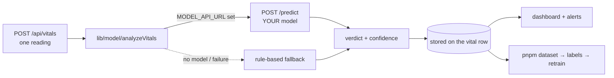

# Nearling Pulse — ML Model Scope

The complete scope of the machine-learning component: what the model is,
what it is not, what it needs, how it will be judged, and how it evolves.

Companion docs:
- `docs/MODEL_CONTRACT.md` — the **interface** contract (exact JSON in/out)
- `docs/TRAINING.md` — the **recipe** (learning path + commands)
- This document — the **scope** (what/when/why/risks/success)

---

## 1. Problem Statement

**Decision served:** after every sensor reading, the system must classify
the animal's health as `healthy`, `warning`, or `critical` — and attach an
honest confidence — so a farmer can decide *when to intervene*.

**Formal framing:** 3-class supervised classification on tabular vital
signs, one reading at a time (cross-sectional), with future optional
extension to sequences (time-series).

**The bar:** the model must beat the deployed rule-based baseline
(`lib/model/rule-based.ts`) on a held-out test set, while keeping the
system functional in every intermediate state (graceful degradation).

**Core tension:** class imbalance (most readings are healthy), label
scarcity (labels only exist when a vet records a check-up), and the cost
of error types (calling a critical animal "healthy" is far worse than the
reverse).

---

## 2. The Model in the System



Constraints that shape the scope:

- The browser **never** calls the model. The backend is the only client.
- The model is **replaceable without touching the rest of the system**
  (the seam). Retraining or swapping it is a deployment action, not a
  code change.
- The system must **never stop making decisions**: rules cover every gap.

---

## 3. Scope Summary

| | In scope | Out of scope (for now) |
|---|---|---|
| **Prediction** | Per-reading 3-class health status + calibrated confidence | — |
| **Modeling** | Classical ML on tabular features (RandomForest, then XGBoost, calibration) | Deep learning, LLMs, image/audio models |
| **Time** | Single reading (cross-sectional) | Sequence models (LSTM/transformer on history) |
| **Data** | Vitals + check-up verdicts from this system | External datasets, third-party farm data |
| **Extras** | Population analytics, per-animal baselines (later phases) | Autonomous intervention, treatment recommendations |
| **Ops** | Versioning, A/B, fallback modes, monitoring | Self-training, auto-retraining pipelines |

---

## 4. Data Scope

### 4.1 Sources

| Source | Table | Role |
|---|---|---|
| Sensor readings | `vitals` | Features (the input) |
| Vet check-ups | `checkups.verdict` | Labels (the ground truth) |
| Animal records | `animals` | Context: type, age, weight, location |

### 4.2 Features — today

| Feature | Range | Source |
|---|---|---|
| `heartRate` | 20–250 bpm | sensor |
| `pulse` | 20–250 bpm | sensor |
| `temperatureC` | 30–45 °C | sensor |
| `oxygenPct` | 50–100 % | sensor |
| `digestScore` | 0–100 | sensor/derived |

These five are the contract's feature vector (`docs/MODEL_CONTRACT.md`).

### 4.3 Candidate features — later phases (contract-extending, additive only)

| Feature | Why |
|---|---|
| **Trends** (Δ vs. the animal's own recent readings) | Illness appears as *change*, not absolutes — the single biggest expected win |
| Time-of-day / activity window | Circadian baselines |
| Age / weight / type | Health ranges differ by animal class |
| Environmental data (temperature, humidity) | Heat stress confounds vitals |
| Model version + history length | Auditability, confidence context |

**Rule:** adding features is backward-compatible — the model server accepts
the core 5 and may ignore or use extra fields. The contract's input grows
additively.

### 4.4 Labels — the bottleneck

- **Source:** the vet's verdict on a check-up (`checkups.verdict`,
  recorded via the verdict toggle in the check-up form).
- **Label window:** a vital reading is labeled by a check-up that occurred
  within `--window-hours` (default 24h) *after* the reading
  (`scripts/export-dataset.py`). Window length is a tunable, documented
  assumption: too short → few labels; too long → noisy labels.
- **Label quality rules (to adopt):**
  - one check-up may only label readings of *its own animal*
  - drop readings that fall in multiple overlapping windows (ambiguous)
  - review obvious label/feature contradictions (e.g. verdict `healthy`
    with temperature 41°C) — usually a vet typo, worth fixing at source
- **Volume targets (honest estimates):**

| Labeled readings | State | Note |
|---|---|---|
| < 100 | Toy | Might beat rules by luck; not trustworthy |
| 100–500 | Experiment | First real signal; treat results as directional |
| 500–2,000 | Usable MVP | Expect a genuinely useful classifier |
| > 2,000 | Solid | Class coverage matters more than total |

With ~8.6k readings/day/animal ingested, **label volume is purely a
function of how consistently vets record verdicts** — the raw data is not
the constraint.

### 4.5 Class imbalance

Healthy dominates. Mitigations already built in: `class_weight="balanced"`
in `scripts/train.py`, and evaluation must use per-class metrics, not
accuracy (see §6).

---

## 5. Modeling Scope (Phases)

### Phase 0 — Baseline ✅ (done)

The rule-based classifier (`lib/model/rule-based.ts`) with fixed
thresholds. Deterministic, explainable, and *already deployed*. It is the
benchmark every later model must beat. Also the safety net forever.

### Phase 1 — MVP classifier (the first model)

> **Status:** a *demonstration* Phase-1 model now exists — trained on
> synthetic data (`scripts/generate-synthetic.py`) to prove the pipeline.
> It serves from `model-server/model.joblib` but must be retrained on real
> verdicts before its output means anything clinically. The go/no-go gates
> below apply to the model trained on real data (`docs/TRAINING.md`).

- **Algorithm:** RandomForest (300 trees, balanced) — as in
  `scripts/train.py`. Deliberately boring: robust, no tuning rabbit holes.
- **Protocol:** animal-grouped 80/20 split (no leakage), seeded shuffle.
- **Go/no-go:** see §6 success criteria.
- **Exit condition:** beats the rules on the test set with acceptable
  per-class recall, confidence calibrated, and deployed behind
  `MODEL_FALLBACK_MODE=fallback`.

### Phase 2 — Robustness ✅ done (demo data)

- ✅ **Trend features** — per-animal change-vs-6h, rolling mean/std engineered in `scripts/train.py`, served from a matching in-memory history buffer in `model-server/app.py` (contract input unchanged)
- ✅ **Calibration auto-select** — sigmoid vs isotonic compared by validation reliability MAE; sigmoid wins on the demo data
- ✅ **Threshold tuning** — weighted cost (critical-missed = 5, warning-call-healthy = 2, false alarm = 1) finds decision thresholds on validation; demo result `critical >= 0.2, warning >= 0.2`
- ✅ **k-fold CV by animal** — `pnpm train --cv` reports mean±std across all animals
- ✅ Demo results improved: critical recall 0.91 → **0.98**, warning recall 0.14 → **0.20** (precision 0.38 → 0.55), CV accuracy **0.970±0.004**
- ⚠️ Residual: mid-confidence bins (0.4–0.9) remain slightly overconfident — a known cost of calibrating on rare classes; flagged by the reliability check. Expect improvement with more real data per class
- ⏭️ XGBoost/LightGBM comparison deferred — trends already addressed the Phase 1 weaknesses; revisit only if real-data training plateaus

### Phase 3 — Temporal ✅ done (demo data)

- ✅ **Window features** — the model now sees the flattened last-7 readings (35 features) instead of hand-crafted aggregates; `scripts/train.py --features window` (default) vs `--features trends` (Phase 2) for comparison
- ✅ **Served unchanged** — `model-server/app.py` builds the same window from its rolling per-animal history buffer, so the HTTP contract is still frozen (no history array in the request needed)
- ✅ Demo results (window vs trends): accuracy 0.959 vs 0.958; **critical recall 0.99**; calibration MAE 0.018 vs 0.022; CV accuracy ≈ 0.968
- 📋 **Finding:** on the synthetic data, hand-crafted trends and raw windows perform nearly identically — the model learned the same temporal signal itself. That validates the simpler window design (less human bias, no hand-picked window math)
- ⏭️ **LSTM deferred** — the scope gates sequence models behind classical plateaus, and it would require a heavy runtime (torch) + thousands of real rows. Windowed trees are the honest Phase 3; revisit LSTM only with real temporal data
- ⚠️ Known limitation demonstrated live: hand-crafted readings *outside the training distribution* can be missed (sharp-jump fever vs the smooth synthetic curve) — real data bounds the model to reality

### Phase 4+ — Product-level intelligence

- **Per-animal adaptive baselines** (an animal's own "normal" drifts)
- **Anomaly detection** across the population (this animal vs. cohort)
- **Early prediction** (risk before status flips: a *probability of
  becoming critical in N hours*)
- **Decision support** (prioritized intervention lists)

Each phase is optional and gated by the previous phase's success — the
system ships and runs at any stage.

---

## 6. Evaluation Scope

### 6.1 Test protocol (fixed)

- Split **by animal**, never by row
- Same test set for model and rule-based baseline
- Report: confusion matrix + per-class precision/recall/F1 + accuracy (for
  reference only)

### 6.2 Success criteria — Phase 1 go/no-go

| Criterion | Requirement |
|---|---|
| Overall accuracy | > rule-based baseline on the same test set |
| `critical` recall | ≥ 0.7 (the expensive error: critical called healthy is the worst outcome) |
| `healthy` precision | ≥ 0.85 (don't flood the farmer with false alarms) |
| `warning` | Monotone-sane: better than random, improving with data |
| Confidence calibration | Predicted probability matches observed frequency within ±0.1 per decile |
| Class coverage | ≥ 30 labeled examples of the rarest class in test |

### 6.3 The metric that matters most

**The "critical-called-healthy" cell of the confusion matrix.** Optimize
everything else around keeping it near zero. A model that misses 10% of
sick animals is worse than one that cries wolf 30% of the time.

---

## 7. Deployment & Ops Scope

| Concern | Scope |
|---|---|
| **Serving** | `model-server/` (FastAPI + joblib) or any contract-compliant server (MLflow, ONNX Runtime) |
| **Activation** | Env-only: `MODEL_API_URL` + `MODEL_FALLBACK_MODE` — no code changes |
| **Fallback** | `fallback` while learning; `strict` only when the model is trusted; rules always available as the rollback |
| **Versioning** | Model URL includes version (`/v1`, `/v2`); keep old deployments for A/B and rollback |
| **A/B** | Run two model URLs side by side; compare confusion matrices on live verdicts |
| **Monitoring** | Track: prediction drift (input distributions), confidence vs. verdict agreement, fallback rate, per-class accuracy on newly labeled data |
| **Retraining cadence** | Event-driven: whenever a batch of new verdicts is large enough (~100+ new labels), export → train → evaluate → deploy |
| **Reproducibility** | Seed the split (42), pin the dataset export, record model version next to stored verdicts (future column) |

---

## 8. Risks & Mitigations

| Risk | Likelihood | Impact | Mitigation |
|---|---|---|---|
| **Label scarcity** (vets don't record verdicts) | High | High | Make verdicts a first-class UI action (done); add labeling convenience (batch entry, per-animal reminder); metrics in the dashboard showing "unlabeled check-ups" |
| **Noisy labels** (window too wide, typos) | Medium | High | Tunable window; review contradictions; keep ambiguous rows out of training |
| **Class imbalance** | Certain | Medium | Balanced weights; threshold tuning; report per-class, not accuracy |
| **Confidence not trustworthy** | Medium | High | Mandatory calibration gate before serving; fallback mode stays lenient |
| **Sensor drift / hardware change** | Medium | Medium | Input-range validation already rejects nonsense; monitor input distributions; retrain on new sensor generation |
| **Overfitting to a few animals** | Medium | High | Animal-grouped splits, k-fold by animal, min animals-per-class in test |
| **The model beats rules by accident** (small data) | Medium | Medium | Go/no-go requires both accuracy *and* per-class recall thresholds; require data volume minimums |
| **Temporal leakage** (future readings labeled by past check-ups) | Low | High | Window only labels readings *before* the check-up (enforced in SQL) |

---

## 9. Explicit Non-Goals (scope protection)

1. **No deep learning** until classical tabular modeling has plateaued.
2. **No autonomous intervention** — the model informs humans; it never
   decides treatment.
3. **No treatment/drug recommendations** — clinical decision support is a
   separate regulated domain.
4. **No external datasets** — the system learns only from its own
   operations (that is the point: *learning over time*).
5. **No real-time on-device inference** — analysis runs server-side;
   tags only emit signals.
6. **No self-training / pseudo-labeling** — labels must come from humans;
   the loop stays honest.
7. **No guarantee of "prediction" claims** — until early-prediction
   models exist (Phase 4+), the product says "monitoring," not "forecasting."

---

## 10. Roles & Ownership

| Work | Owner |
|---|---|
| Data collection, labeling discipline, model choice, training, evaluation | **You** |
| Contract, serving skeleton, evaluation tooling, dataset export, deployment seam | Repo (built) |
| Ground-truth data | **Vets** (via check-ups) |

The system's job is to make your job easier: the seam, contract, export,
training, and serving pipeline are already built and tested. Your remaining
work is data, iteration, and judgment.

---

## 11. Realistic Timeline

| Phase | Effort (part-time) | Depends on |
|---|---|---|
| Learn fundamentals (§ of TRAINING.md) | 2–3 weeks | — |
| First dataset + Phase 1 model | 2–4 weeks after labels exist | ~100+ labeled readings |
| Calibration + threshold tuning | 1 week | Phase 1 passes |
| Trends / feature expansion | 1–2 weeks | running system |
| Temporal models | 3–6 weeks | 2,000+ labeled readings |
| Population analytics | per-product | running system |

The critical path is **labeled data**, which grows only while the system
runs in the field. Start running and labeling now; the modeling keeps pace.

---

## 12. Appendix — Quick Reference

**Contract** (`docs/MODEL_CONTRACT.md`): `POST /predict` in = one reading
(5 features + animalId + recordedAt); out = `{ healthStatus, confidence,
score?, reasons? }`.

**Baseline thresholds** (`lib/model/rule-based.ts`):

| Metric | Warning | Critical |
|---|---|---|
| temperatureC | ≥ 39.2 | ≥ 39.8 |
| heartRate | ≥ 85 | ≥ 100 |
| oxygenPct | ≤ 95 | ≤ 90 |
| digestScore | ≤ 80 | ≤ 60 |

**Commands:**

```bash
pnpm dataset                      # export labeled CSV
pnpm train                        # train + evaluate + save model.joblib
cd model-server && MODEL_PATH=model.joblib uvicorn app:app --port 8000
# .env: MODEL_API_URL=http://localhost:8000  MODEL_FALLBACK_MODE=fallback
```

**Labeling:** check-up form → verdict buttons (Healthy / Warning / Critical).
