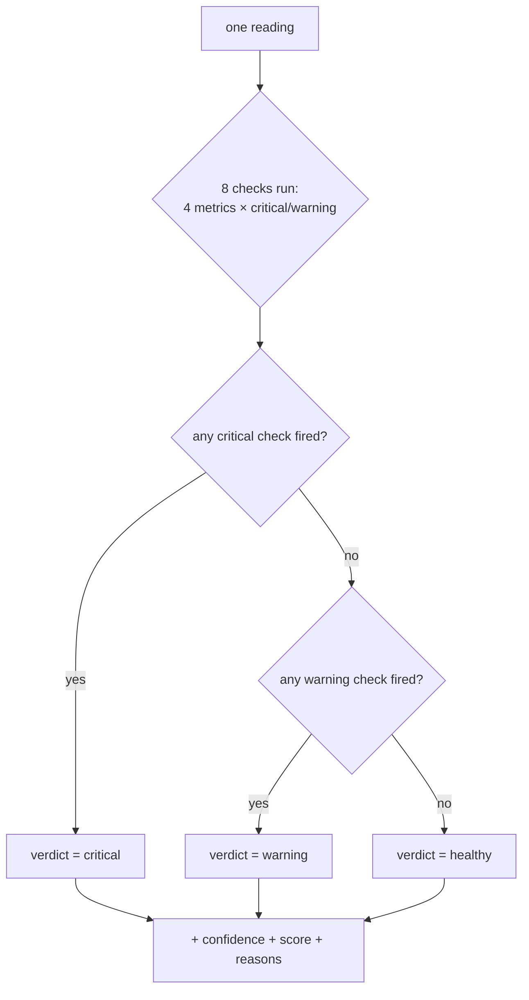

# The Rule-Based Baseline — Explained

The complete explanation of the classifier currently making health
decisions in Nearling Pulse — what it is, exactly how it decides, why the
numbers are what they are, and why it matters for the ML model.

> **Where it lives:** `lib/model/rule-based.ts`
> **What pins its behavior:** `tests/rule-based.test.ts`
> **Python twin (for comparison):** `rule_based()` in `scripts/train.py`

---

## 1. What it is

The rule-based classifier is a **deterministic threshold system**: given one
vital reading, it compares each of four metrics against fixed cutoff values
and produces one of three verdicts — `healthy`, `warning`, or `critical`.

It is called a *baseline* because it sets the floor for quality:

- the ML model must **beat it** on a held-out test set
- it remains the **safety net** forever (if the model is down, rules take over)

It requires **no data and no learning**. It is a hand-written expert
decision procedure — which is exactly why it is easy to explain, audit,
and improve later.

### Where it sits in the system

```mermaid
flowchart LR
    V[POST /api/vitals<br>one reading] --> A[analyzeVitals]
    A -->|MODEL_API_URL not set| R[rule-based classifier]
    A -.->|model failed, fallback mode| R
    R --> O[{healthStatus,<br>confidence, score, reasons}]
    O --> DB[(stored: status + confidence)]
    O --> RESP[201 response: full analysis]
```

The verdict + confidence are persisted on the `vitals` row; the `reasons`
are returned to the caller at ingestion time (they are informative, not stored).

---

## 2. The algorithm, step by step

1. Start with `healthStatus = "healthy"` and an empty `reasons` list.
2. Run **eight threshold checks** — four metrics × two severity levels.
3. Each check that fires pushes a human-readable reason.
4. **Precedence:** any `critical` check forces the final verdict to
   `critical`; otherwise any `warning` check forces `warning`; otherwise
   the reading stays `healthy`.
5. Assign a fixed confidence and score based on the final verdict.
6. Return `{ healthStatus, confidence, score, reasons }`.

The precedence is the crucial detail — the classifier is **not**
"first matching rule wins" in order; it is **"worst matching rule wins"**
(critical beats warning beats healthy). A single critical metric dominates
the verdict no matter how many warnings fired.



---

## 3. The thresholds

These are the exact constants from `lib/model/rule-based.ts`:

| Metric | Warning rule | Critical rule |
|---|---|---|
| `temperatureC` | ≥ 39.2 °C | ≥ 39.8 °C |
| `heartRate` | ≥ 85 bpm | ≥ 100 bpm |
| `oxygenPct` | ≤ 95 % | ≤ 90 % |
| `digestScore` | ≤ 80 | ≤ 60 |

Important: **boundary values are inclusive** (`≥` / `≤`). A temperature of
exactly 39.2°C *is* a warning; exactly 39.8°C *is* critical. The unit tests
pin these boundaries so nobody "fixes" them by accident.

### Where the numbers come from

These are **engineering defaults**, chosen as rough approximations of
normal physiological ranges (mainly for cattle), deliberately wide enough
not to cry wolf on healthy animals:

| Metric | Approximate normal (cattle) | So the warning threshold means |
|---|---|---|
| Temperature | ~37.8–39.2 °C | a degree-ish above normal → keep an eye |
| Heart rate | ~48–84 bpm | at/above 85 → elevated |
| Oxygen | typically high (95 %+) | below 95 → mildly low; below 90 → concerning |
| Digest score | 0–100, higher is better | below 80 → below par; below 60 → poor |

⚠️ **These are NOT clinical guidelines.** They are a first guess that the
whole project exists to improve on. A veterinarian should validate or
re-set them; the ML model's job is to learn better decision boundaries
from real labeled data.

### One global size fits no one

The thresholds are **fixed for every animal**: a dairy cow, a sheep, and a
goat all share them. Real physiology differs by species, age, weight, and
individual — this is one of the biggest weaknesses of the baseline, and a
core motivation for a learned model (see §7).

---

## 4. Outputs

| Field | Meaning | Rules version |
|---|---|---|
| `healthStatus` | The verdict | `healthy` / `warning` / `critical` |
| `confidence` | Model's stated certainty (0–1) | Fixed per verdict: `0.9` healthy, `0.8` warning, `0.7` critical — **arbitrary, not calibrated** |
| `score` | 0–100 health score | `90` healthy / `70` warning / `40` critical |
| `reasons` | Human-readable explanation | e.g. `"heart rate 92 bpm is elevated"` |

Note the confidence is a **constant per verdict** — it is a placeholder so
the UI/API shapes work, not a statistical estimate. One of the ML model's
requirements (see `docs/MODEL-SCOPE.md` §6) is *real* calibration, so the
number farmers see means something.

---

## 5. Worked examples

Using the seeded demo animals:

| Reading | Checks that fire | Verdict |
|---|---|---|
| **Bessie**: HR 68, temp 38.2, O₂ 98, digest 92 | none | `healthy` (conf 0.9, score 90, no reasons) |
| **Daisy**: HR 85, temp 39.1, O₂ 95, digest 78 | HR ≥85 → warning · O₂ ≤95 → warning · digest ≤80 → warning | `warning` (3 reasons) |
| **Clara**: HR 102, temp 39.8, O₂ 92, digest 65 | temp ≥39.8 → **critical** · HR ≥100 → **critical** | `critical` (2 reasons) |
| Edge: temp 39.3 (warning) **and** HR 101 (critical) | both fire | `critical` — critical wins over warning |

The Daisy example shows the "worst rule wins" behavior from another angle:
three separate warnings still land at `warning`, not `critical` — only a
critical rule promotes the verdict.

---

## 6. Strengths — why it's a good baseline

1. **Zero data required.** It works from day one, before a single label exists.
2. **Deterministic.** Same input → same output, every time. Auditable.
3. **Instantly explainable.** Every verdict carries human-readable reasons —
   a farmer can see *why*.
4. **Testable.** The boundary conditions are pinned by unit tests
   (`tests/rule-based.test.ts`), so behavior can't silently drift.
5. **A fair benchmark.** It's already deployed, so the ML model has a
   concrete, measurable opponent on the exact same test set
   (`scripts/train.py` computes both accuracies).
6. **The safety net.** In `MODEL_FALLBACK_MODE=fallback`, the system
   degrades to rules when the model is down — decisions never stop.

---

## 7. Weaknesses — why it must be replaced

These are the *exact gaps* the ML model exists to fill:

| Weakness | Consequence |
|---|---|
| **No learning** | Never improves with data; knowledge must be hand-encoded |
| **No context** | Every animal judged by identical global thresholds — species, age, and individual differences ignored |
| **No time dimension** | A single snapshot only; trends (rising fever *over time*) are invisible |
| **No interactions** | Metrics are checked independently — a fever *with* low oxygen is treated the same as either alone |
| **Arbitrary confidence** | 0.9/0.8/0.7 are placeholders, not probabilities |
| **Hand-tuned by guesswork** | Thresholds are engineering guesses, not learned from outcomes |
| **Silent about near-misses** | 39.1°C is "healthy" but 39.2°C is "warning" — a hard cliff with no gradient |

The last point is subtle and important: **the rules draw a hard line in
the sand, but biology is graded, not binary.** A learned model can
express *how close* a reading is to trouble (probabilities, gradients,
per-animal baselines) instead of forcing every case into three buckets
with two hard boundaries.

---

## 8. How the ML model will beat it (the benchmark protocol)

1. `scripts/export-dataset.py` produces a labeled CSV.
2. `scripts/train.py` splits **by animal** (80/20) — the *same* test
   animals are used for both the model and the rules.
3. The model is trained on the train set; the rules need no training.
4. Both are evaluated on the identical test set: confusion matrix +
   per-class report + overall accuracy.
5. Go/no-go (`docs/MODEL-SCOPE.md` §6): the model must beat rules on
   accuracy *and* clear per-class recall/calibration gates — beating the
   rules on accuracy alone is not enough (an accuracy-only win can hide a
   model that's great at "healthy" and blind to "critical").

Because the rules are transparent, you can also do a **qualitative**
comparison: find readings the model calls differently than the rules, and
ask "which one was right?" — those disagreements are the learning signal
that matters.

---

## 9. Quick reference

| Question | Answer |
|---|---|
| What does it output? | `{ healthStatus, confidence, score, reasons }` |
| How many checks? | 8 (4 metrics × warning/critical) |
| Tie-break rule | critical > warning > healthy |
| Are boundaries inclusive? | Yes (`>=` / `<=`) |
| Where are the thresholds? | `RULE_THRESHOLDS` in `lib/model/rule-based.ts` |
| Where is it tested? | `tests/rule-based.test.ts` |
| Where is the Python twin? | `rule_based()` in `scripts/train.py` |
| When does it run in production? | Always, until `MODEL_API_URL` is set; after that, whenever the model is unavailable in `fallback` mode |
