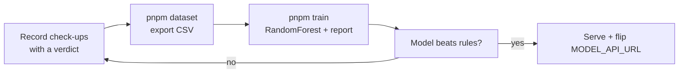

# Training the Health Model — Your Step-by-Step Recipe

You have no ML background — that's fine. This project is deliberately the
easiest kind of ML: **5 numeric features, 3 classes, tabular data**. You use
libraries, you never implement algorithms. This document is the whole recipe.

---

## The 6 concepts you need (learn these first)

| Concept | One-liner | Why it matters here |
|---|---|---|
| **Labels** | The answer your model learns to predict | The vet's **verdict** on a check-up is your label |
| **Train/test split** | Train on one set, test on data the model never saw | Without it your "accuracy" is fake |
| **Leakage** | Test data sneaking into training | Split by **animal**, not by row |
| **Metrics** | Accuracy lies with imbalanced classes | Use the **confusion matrix** + report |
| **Baseline** | A simple model to beat | You already have one: the rule-based classifier |
| **Calibration** | Confidence that means what it says | The dashboard shows confidence — it must be honest |

### Free resources (in this order)

1. **StatQuest with Josh Starmer** (YouTube) — the *Machine Learning
   Fundamentals* playlist, then *Random Forests*, *Cross Validation*,
   *Precision and Recall*, *Imbalanced Data*.
2. **Kaggle Learn** — *Intro to Machine Learning* + *Intermediate Machine
   Learning* (free, browser-based, scikit-learn — your exact tools).
3. **scikit-learn's "A tutorial on statistical-learning"** — the official
   walkthrough of the whole workflow.

Skip neural networks, PyTorch, LLMs, and math courses entirely for now.

---

## The pipeline (all plumbing is built for you)



### Step 0 — Environment (once)

```bash
python -m venv .venv
# Windows:  .venv\Scripts\activate      macOS/Linux:  source .venv/bin/activate
pip install -r scripts/requirements.txt
```

### Step 1 — Collect labels (ongoing, passive)

Vets record check-ups on the dashboard. **Always set the verdict buttons**
(Healthy / Warning / Critical) — that verdict is your ground truth. One row
of training data = one vital reading in the 24h before a verdict-bearing
check-up. Target: a few hundred labeled readings before training gets serious.

### Step 2 — Export the dataset

```bash
DATABASE_URL=postgres://... pnpm dataset
```

Produces `scripts/dataset.csv` with columns:
`animal_id, recorded_at, heart_rate, pulse, temperature_c, oxygen_pct, digest_score, verdict, checkup_at`

### Step 3 — Train

```bash
pnpm train
```

What happens:
- splits by **animal** (80/20, seeded shuffle) so no animal leaks across splits
- trains a RandomForest (300 trees, class-balanced — healthy animals
  outnumber sick ones, so the model must not just predict "healthy")
- prints a **confusion matrix** (rows = actual verdict, cols = predicted) and a
  **classification report** (per-class precision / recall / F1)
- compares its accuracy against the rule-based baseline on the same test set

### Step 4 — Decide

- **Beat the rules?** → serve it (Step 5). The bar is low on purpose.
- **Not yet?** → almost always a *data* problem, not a modeling problem:
  more labeled check-ups, more animals, more warning/critical examples.
  Don't tune hyperparameters yet.

### Step 5 — Serve

```bash
cd model-server
MODEL_PATH=../model-server/model.joblib uvicorn app:app --port 8000   # train.py already saves there
```

Then in the app's `.env`:

```
MODEL_API_URL=http://localhost:8000
MODEL_FALLBACK_MODE=fallback   # start lenient: fall back to rules when unsure
```

Restart the app. Every ingested reading is now analyzed by YOUR model.
Watch the confidence values on the dashboard — if they look wrong, that's
a calibration problem (see below), not necessarily a prediction problem.

---

## Reading your results (the part that matters)

**Confusion matrix** — the most useful output. Example:

```
              predicted
             healthy warning critical
actual
healthy        120      8       1
warning         10     22       3
critical         1      2       9
```

Read the **off-diagonals**: a critical animal called "healthy" (bottom-left)
is your worst failure — it means a sick animal goes unnoticed. If that cell
is bad, prioritize recall for critical, then collect more critical examples.

**Accuracy is not the goal.** If 90% of animals are healthy, a model that
always says "healthy" scores 90% and is useless. Judge by the report's
per-class F1 and by the confusion matrix's bad diagonals.

## Iterating

1. More labeled data (the #1 lever)
2. Rebalance or weight classes (the script already uses `class_weight="balanced"`)
3. Only then: try XGBoost, tune hyperparameters
4. When confidence matters, calibrate with `CalibratedClassifierCV`
   (sklearn) before serving — the dashboard shows confidence to farmers,
   so it must mean what it says

## FAQ

- **How much data?** ~100 readings → toy; a few hundred → useful; it keeps
  improving as the farm runs. Data beats algorithms at this scale.
- **My model can't beat the rules.** Expected early. Rules are already
  decent on obvious cases. You're learning the hard cases — that's the point.
- **Can I use deep learning?** Only after classical ML stops improving.
  Sequence models (LSTM on time history) are a later upgrade; the model
  contract doesn't change.
- **Who owns what?** You own data, labels, model choice, and training. The
  repo owns exporting, evaluating, serving, and the contract
  (`docs/MODEL_CONTRACT.md`).
